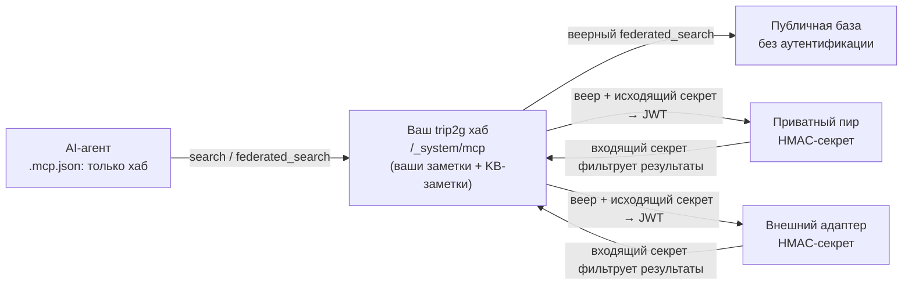

MCP Federation соединяет вашу базу знаний trip2g с другими MCP-совместимыми базами. AI-агент обращается к одному эндпоинту (вашему хабу) и ищет по всем подключённым базам: публичным справочникам, базам партнёров и внешним адаптерам (GitHub, Telegram).



*Топология федерации: агент видит один MCP-эндпоинт; хаб рассылает запрос по всем подключённым пирам и объединяет результаты.*

### Как это работает

```
┌─────────────────────────┐
│  Ваш AI-агент           │
│  .mcp.json: ваш хаб     │
└────────────┬────────────┘
             │
┌────────────▼────────────┐
│  Ваш trip2g хаб         │
│  /_system/mcp           │
│  • ваши заметки         │
│  • KB-заметки на пиров  │
│    и адаптеры           │
└─┬──────────┬───────────┬┘
  │          │           │
  ▼          ▼           ▼
Публичная  Партнёр    Внешний
база       (HMAC)     адаптер
(без auth)            (HMAC)
```

Хаб не хранит удалённый контент: только ваши заметки, KB-заметки для роутинга и federation secrets в базе данных.

### Основные понятия

**KB-заметка**: обычная заметка Obsidian с полем `mcp_federation_kb_url` в frontmatter. Это поле регистрирует пира. Тело заметки содержит произвольный текст с описанием, когда использовать эту базу; агент читает его во время поиска.

**Federation secret**: общий HMAC-ключ для аутентификации вашего хаба у приватного пира (и наоборот). Для публичных баз секрет не нужен.

**Ключ передачи**: одна строка base64, в которой лежат три значения, работающие только вместе: идентификатор ключа, адрес `/_system/mcp` того инстанса, который его выдал, и сам секрет. Это то единственное, что один оператор отправляет другому. Ключ передачи не защищает секрет, а только упаковывает: внутри секрет лежит открытым текстом, поэтому отправлять ключ нужно по каналу, которому вы доверили бы пароль.

**kb_id**: короткий slug для идентификации пира. По умолчанию совпадает с hostname URL; переопределяется полем `mcp_federation_kb_id`.

### Добавить публичного пира

Создайте заметку в хранилище с таким frontmatter:

```yaml
---
mcp_federation_kb_url: https://philosophers.example.com/_system/mcp
mcp_federation_kb_id: philosophy
---
Использовать для: поиска философских отсылок к инженерным решениям.
Не использовать для: срочных задач и узкоспециализированных тем.
```

Нажмите Sync. Готово. Агент обращается к этой базе через `federated_search` с `kb_id="philosophy"` или автоматически при веерном поиске по всем базам.

Поле `mcp_federation_kb_id` необязательно. Если его нет, kb_id будет равен hostname URL (`philosophers.example.com`).

### Добавить приватного пира

Приватные пиры аутентифицируются общим HMAC-ключом. Настройка требует двух операторов и одного значения, которое передают из рук в руки.

**Шаг 1. Боб выпускает ключ для вас.**

Боб открывает Администрирование → Федерация → «Добавить входящий секрет», задаёт короткий идентификатор (`alice-2026`), при желании описание, и нажимает «Сгенерировать секрет». Страница показывает ключ передачи с кнопкой «Скопировать ключ передачи», а ниже отдельно сам секрет. После ухода со страницы ни то, ни другое не показывается снова.

Боб отправляет вам ключ передачи по каналу, которому доверил бы пароль: например, личным сообщением в Telegram. Больше отправлять нечего: адрес его инстанса и идентификатор ключа уже упакованы внутрь, поэтому ни ему, ни вам нечего потерять или переставить местами.

**Шаг 2. Вы устанавливаете ключ.**

Откройте Администрирование → Федерация → «Добавить исходящий секрет», вставьте ключ передачи в первое поле и нажмите «Добавить исходящий». Поля «Идентификатор ключа», «Секрет (hex)» и «URL базы знаний» оставьте пустыми: это ручной путь для пира, который прислал три значения вместо одного. Если заполнено и то и другое, побеждает ключ передачи.

Перед тем как записать секрет, ваш хаб вызывает хаб Боба и заменяет полученный секрет новым случайным: байты, прошедшие через переписку, перестают быть рабочим ключом. Если хаб Боба отказал или не ответил, не записывается ничего, а форма показывает причину. Подробности в разделе «Ротация ключей».

**Шаг 3. Боб выдаёт доступ к подграфам.**

Новый входящий ключ не даёт доступа ни к одному подграфу. Боб открывает строку ключа в своей админке и отмечает подграфы в блоке «Доступ к подграфам». Пока он этого не сделал, ваши запросы через этот ключ проходят аутентификацию и возвращают пустой результат, неотличимый от запроса, который ничего не нашёл.

**Шаг 4. Создайте KB-заметку.**

```yaml
---
mcp_federation_kb_url: https://bob.team.io/_system/mcp
mcp_federation_kb_id: bob
---
Использовать для: статусов задач Боба, общих заметок по дизайну.
```

**Шаг 5. Настройте обратное направление (опционально).**

Если Боб тоже хочет запрашивать вашу базу, повторите процесс в обратную сторону: вы добавляете входящий секрет, отправляете Бобу его ключ передачи, Боб вставляет ключ в свою форму «Добавить исходящий секрет».

Каждое направление независимо. Можно дать Бобу доступ к подграфу `team-status`, не открывая остальное.

### Ротация ключей

К моменту установки секрет из ключа передачи уже прошёл через окно чата. Он остаётся в истории сообщений, а если ключ передавал AI-агент, то и в его транскрипте. Ротация заменяет секрет, и эти копии перестают работать.

**При установке.** Добавление исходящего секрета по умолчанию запускает ротацию. Хаб просит пира принять новый ключ на 32 байта и записывает строку только после подтверждения. Пир отказал или промолчал: не сохраняется ничего. Защищать пока нечего, поэтому дешевле попросить у второго оператора новый ключ передачи и повторить.

**Позже, по кнопке.** На странице исходящего ключа есть кнопка «Ротировать ключ», та же операция доступна в GraphQL как `rotateFederationSecret(kid:)`. У входящих строк кнопки нет: входящий ключ принадлежит другой стороне и ротирует его она.

**Окно совместимости.** Обе стороны пять минут принимают тот ключ, от которого ушли. Это спасает связь, когда ответ на ротацию потерялся: хаб подписывает запрос новым ключом, пир отказывает, хаб повторяет со старым и проходит. Повторная ротация предлагает тот же ключ, и пир, который его уже применил, отвечает как на пустую операцию. Старый ключ выбрасывается сразу же, как только новый подтвердится любым успешным вызовом, обычно за миллисекунды.

**Пиры, которые не умеют ротировать.** Ротация начинается с вызова, который ваш хаб делает пиру, и пир должен уметь его обработать. Адаптеры и старые инстансы не умеют и отвечают отказом. Для них в GraphQL есть поле `rotate: false`: секрет сохраняется как есть, ротация не запускается. В форме админки переключателя нет, поэтому такого пира заводят через API.

**HTTPS.** Ротация несёт новый секрет по сети, поэтому по адресу `http://` она запрещена. Исключение: инстанс, который уже объявил, что федерируется по адресам вне публичного интернета, флагом `--mcp-federation-allow-private` или режимом разработки. Там запрет не действует.

### Что пир вам выдал

Хаб умеет спросить у пира, что представляет собой ваша пара ключей. Это подписанный GET на `/_system/mcp/federation` пира. В ответе идентификатор ключа, подграфы, которые он может читать, и признак поддержки ротации:

```json
{
  "version": 1,
  "kid": "alice-2026",
  "subgraphs": [
    { "name": "team-status", "human_description": "Еженедельные статусы команды платформы" }
  ],
  "rotation": true
}
```

Страница исходящего ключа спрашивает это при каждом открытии и показывает ответ в блоке «Выдано пиром». Пустой список это не ошибка, а полноценный ответ: ключ аутентифицируется и не видит ничего. Страница пишет это словами, вместо того чтобы показать пустую таблицу. Если пир не ответил, вместо списка выводится его ошибка.

Вызов без действительной подписи получает 401 без подробностей.

### Описание подграфа

У подграфа есть описание в одно предложение: Администрирование → Подграфы → выберите подграф → поле «Что это за подграф». Описание уходит пиру вместе с именем подграфа, поэтому оператор, которому вы выдали доступ, читает, что именно ему выдали, а не гадает по слагу. Если оставить поле пустым, пир увидит пустую строку: ничего вымышленного на его экране не появится.

### Список секретов

Администрирование → Федерация показывает все ключи с колонкой «Направление», поэтому входящий и исходящий не спутать. Направление определяется по URL базы знаний: ключ без URL пир использует, чтобы позвонить вам, ключ с URL вы используете, чтобы позвонить наружу.

Рядом колонка «Ротация», а страница ключа пишет то же значение словами в поле «Последняя ротация». «Никогда» означает, что ключ остался тем самым, с которым его создали, а для исходящего это тот ключ, который пришёл по чату.

### Инструменты федерации

Хаб предоставляет один и тот же набор MCP-методов, независимо от количества подключённых пиров:

| Метод | Описание |
|-------|----------|
| `search(query)` | Локальный поиск по вашим заметкам |
| `similar(note_id)` | Похожие заметки локально |
| `note_html(note_id)` | Содержимое локальной заметки |
| `expand(pid, toc_path?)` | Обход оглавления локальной заметки по уровням, см. [[ru/user/expand]] |
| `federated_search(query, kb_id?)` | Поиск по пирам (веерный или точечный) |
| `federated_similar(note_id, kb_id)` | Похожие заметки у конкретного пира |
| `federated_note_html(note_id, kb_id)` | Содержимое заметки у конкретного пира |
| `federated_expand(kb_id, pid, toc_path?)` | Обход оглавления удалённой заметки у конкретного пира, тот же интерфейс, что [[ru/user/expand\|expand]], применённый к удалённой базе — раздел без подразделов приходит как содержимое, как его вернул бы `federated_note_html` |
| `federated_instructions(kb_id)` | Инструкции самого пира, их читают перед поиском по нему |

`federated_search` без `kb_id` веерно обращается ко всем доступным пирам параллельно и объединяет результаты. С `kb_id="bob"` обращается только к базе Боба. С `kb_ids=["bob","philosophy"]` обращается ровно к этим двум.

Когда локальный `search` находит KB-заметку, он возвращает её с маркером `kind: "federation_kb"` и инструкцией агенту вызвать `federated_search` с соответствующим `kb_id`. Агент собирает контекст по мере запросов, без выгрузки всего заранее.

Ротации в этом списке нет, и в `tools/list` она не появляется. Метод выполняется только для вызова, который уже доказал свою пару ключей, для всех остальных его не существует. Так ротация остаётся вне поля зрения агента, который читает список инструментов и пробует всё подряд.

### Права доступа

Федерация использует существующую систему подграфов trip2g.

**Исходящий доступ (что видят пиры у вас).** Когда хаб Боба обращается к вашему с валидным JWT, ваш экземпляр проверяет, какие подграфы привязаны к его `kid`, и фильтрует результаты. Заметки вне этого scope невидимы для Боба, так же как для любого другого читателя без доступа.

**Входящий доступ (что видите вы у пиров).** KB-заметки являются обычными заметками, им можно назначить подграф. Если позднее вы откроете хаб коллегам, они увидят только те KB-заметки, подграф которых им доступен локально.

**Что пир может узнать и изменить в своей паре ключей.** Кроме поиска пир с действительным ключом делает две вещи. Он читает свою пару на `/_system/mcp/federation`: идентификатор ключа, выданные подграфы с описаниями и ничего о ваших остальных пирах. И он заменяет свой ключ, то есть выполняет ротацию. Идентификатор ключа всегда берётся из проверенной подписи, а не из аргумента, поэтому пир описывает и ротирует только ту пару, которой аутентифицировался.

**Уровни видимости KB-заметок.** KB-заметка подчиняется тем же правилам видимости, что и обычная заметка:

| Frontmatter KB-заметки | Анонимный MCP-агент | Аутентифицированный подписчик | Администратор |
|------------------------|---------------------|-------------------------------|---------------|
| `free: true` | ✓ маршрутизация работает | ✓ маршрутизация работает | ✓ |
| _(нет флагов)_ | ✗ "not configured" | ✓ маршрутизация работает | ✓ |
| `subgraphs: team` | ✗ "not configured" | только при подписке на `team` | ✓ |

KB-заметка без `free:` и без `subgraphs:` **не является** «только для администратора»: её видит любой аутентифицированный подписчик. Чтобы KB-заметка была доступна только администраторам, поместите её в подграф, к которому у обычных пользователей нет доступа (например, `subgraphs: admin-only`). Ответ `federated_search` на недоступный `kb_id` всегда «not configured», неотличим от несуществующего `kb_id`, поэтому существование пира не раскрывается.

### Граф федерации (панель self-hosted)

Если trip2g запущен за simplepanel, в разделе **Администрирование → Federation** есть страница с графом, отображающим текущее состояние всех инстансов пула в виде направленного графа. Каждый узел соответствует инстансу, каждое ребро соответствует обнаруженной federation-связи.

Цвет ребра отражает статус соединения:

| Статус | Значение |
|--------|---------|
| `ok` | KB-заметка, исходящий секрет и совпадающий неотозванный входящий секрет с хотя бы одним подграфом. Связь работает. |
| `no_auth` | KB-заметка есть, исходящего секрета нет. Агент попытается позвонить пиру, пир ответит 401. Добавьте исходящий секрет. |
| `orphan_secret` | Исходящий секрет записан, но KB-заметка не указывает на пира. Агент никогда не обнаружит этот маршрут. Добавьте KB-заметку. |
| `one_way` | Исходящий секрет и KB-заметка есть, но у пира нет входящего секрета для этого `kid`. Пир ответит 401. Попросите пира добавить входящий секрет для вашего `kid`. |
| `no_access` | Связь установлена, но входящий секрет не даёт доступа ни к одному подграфу, пир получает пустые результаты. Расширьте scope. |
| `revoked` | Исходящий секрет отозван. Маршрут нерабочий, запись следует удалить. |
| `external` | URL назначения не является инстансом пула (публичная или внешняя база). Только информативно. |

На странице также выводится список **Issues**: ошибки конфигурации, обнаруженные при сканировании, с уровнем важности (`error` / `warning` / `info`) и описанием по каждому ребру. Это позволяет диагностировать проблемы, не читая логи.

### Отозвать доступ

Администрирование → Федерация → найдите строку → «Отозвать». Строка становится серой. Все последующие запросы с этим `kid` получают ответ 401. Координация с пиром не нужна: его вызовы просто начнут завершаться ошибкой.

Отзыв убивает текущий ключ вместе с предыдущим, поэтому через окно совместимости до отозванной пары тоже не достучаться.

Чтобы сузить scope без полного отзыва, снимите отдельные подграфы в блоке «Доступ к подграфам».

### Ограничения

- **Аутентификация:** только HMAC-SHA256. mTLS и OAuth не поддерживаются в текущей версии.
- **Таймаут веерного поиска:** 2 секунды на каждый вызов пира. Медленные или недоступные пиры пропускаются; результаты от остальных возвращаются.
- **Глубина рекурсии:** по умолчанию 3 уровня (настраивается через `MCP_FEDERATION_MAX_DEPTH` на self-hosted). Защищает от петель, когда пиры сами имеют пиров.
- **TLS:** для поискового трафика хаб не форсирует HTTPS. Исключение только у ротации: она отказывает адресу без HTTPS. Используйте HTTPS-URL пиров в продакшене.
- **Окно совместимости при ротации:** пять минут. Всё это время пир принимает оба ключа, а значит, владелец старого ключа успевает ротировать пару на себя. Успешный вызов закрывает окно раньше срока.

### Диагностика

**`federation_not_configured` в ответе агента.** В хранилище нет KB-заметок или поле `mcp_federation_kb_url` отсутствует либо написано с ошибкой.

**«Добавить исходящий» сообщает, что пир отказался от нового ключа.** Пир ответил и сказал «нет». Обычно это адаптер или слишком старый инстанс без поддержки ротации. Заведите его через API с `rotate: false` или попросите оператора обновиться.

**«Добавить исходящий» сообщает, что пир не ответил.** Адрес недоступен или это не эндпоинт `/_system/mcp` пира. Не сохранилось ничего. Проверьте URL, затем попросите у второго оператора новый ключ передачи: первый уже предложен тому, кто ответил.

**«rotation needs an https peer address».** URL базы знаний пира начинается с `http://`. Либо выдайте пиру сертификат, либо, если он в вашей приватной сети, запустите инстанс с флагом `--mcp-federation-allow-private`.

**Кнопка «Ротировать ключ» сообщает, что пир не ответил.** Новый ключ уже записан на вашей стороне, предыдущий сохранён, связь работает. Нажмите кнопку ещё раз, когда пир вернётся: повтор предлагает тот же ключ, а не новый.

**Ошибки 401 в логах хаба.** Исходящий секрет не совпадает с тем, что ожидает пир, или пир отозвал ваш `kid`. Попросите у пира новый входящий секрет и установите его ключ передачи.

**Пир не возвращает результатов, ошибки нет.** Scope вашего `kid` у пира пуст. Откройте страницу исходящего ключа и прочитайте блок «Выдано пиром»: если там написано, что пир не выдал ни одного подграфа, Бобу нужно добавить хотя бы один на своей стороне.

**Веерный поиск всегда занимает 2 секунды.** Один или несколько пиров недоступны. Проверьте логи хаба с префиксом `mcp:federation`: там будут предупреждения с указанием конкретного пира и временем ожидания.

### Дополнительно

- [[ru/hub/_index|Хаб]]: базы знаний, подключённые к этому хабу
- [[ru/user/mcp|MCP-сервер]]: как работает локальный MCP-сервер
- [[ru/user/selfhosted|Self-hosted]]: переменная `MCP_FEDERATION_MAX_DEPTH` и другие настройки
- [[ru/user/advanced|Расширенные настройки]]: подграфы и управление доступом
