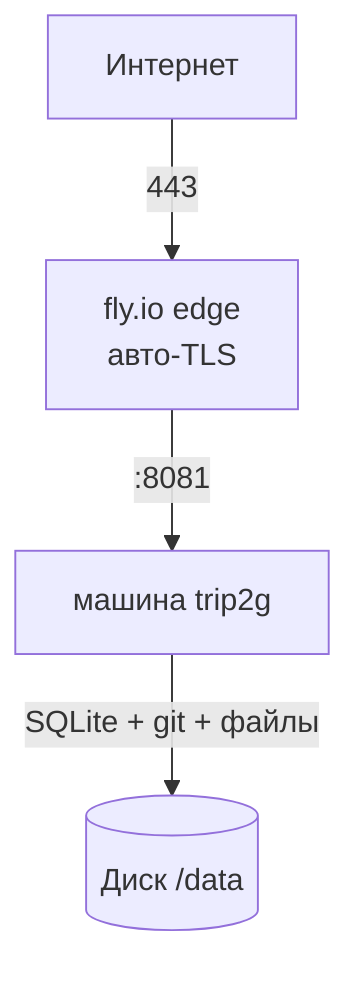

**Коротко:** `fly launch` из этого репозитория, один диск, два секрета — и trip2g работает на fly.io. Одна машина, один диск, файлы лежат на диске. Без MinIO, без отдельной базы, без второго сервера.

---

trip2g — это один Go-бинарь с SQLite, поэтому он идеально ложится на модель fly.io «одна машина + один диск». В репозитории уже есть готовый [`fly.toml`](https://github.com/trip2g/trip2g/blob/main/fly.toml) и скрипт [`scripts/deploy-fly.sh`](https://github.com/trip2g/trip2g/blob/main/scripts/deploy-fly.sh) — конфиг руками писать не нужно.

Это самый простой боевой вариант: файлы хранятся прямо на диске машины через встроенный бэкенд `local`, поэтому больше ничего поднимать не надо. Эти файлы лежат на персистентном volume и переживают любой `fly deploy` — но один том живёт на одном хосте в одной зоне. Чтобы файлы пережили потерю машины (и чтобы можно было запускать больше одной машины), вынесите их в S3 — см. [Хранилище файлов: диск или S3](#хранилище-файлов-диск-или-s3).



## Что нужно

- аккаунт на [fly.io](https://fly.io) (бесплатного лимита хватит для старта)
- установленный `flyctl`: `curl -L https://fly.io/install.sh | sh`
- этот репозиторий, склонированный локально
- `fly auth login`

Это весь список. Ни домена, ни S3-бакета, ни почтового провайдера на старте — fly сам даёт бесплатный адрес `https://<app>.fly.dev` с TLS.

## Быстрый путь: один скрипт

Из корня репозитория:

```bash
APP=my-notes OWNER_EMAIL=you@example.com ./scripts/deploy-fly.sh
```

Скрипт делает всё по порядку:

1. создаёт приложение `my-notes` (если его ещё нет);
2. создаёт диск `trip2g_data` на 1 ГБ, смонтированный в `/data`;
3. генерирует и ставит два обязательных секрета (`JWT_SECRET`, `DATA_ENCRYPTION_KEY`) и ваши `PUBLIC_URL` / `OWNER_EMAIL`;
4. собирает образ на удалённых билдерах fly и деплоит.

Повторный запуск безопасен: существующие приложение, диск и секреты переиспользуются, а не пересоздаются, — данные и сессии переживают каждый редеплой.

Когда скрипт закончит, откройте `https://my-notes.fly.dev` и войдите под `OWNER_EMAIL`.

## Ручной путь: четыре команды

Если хотите видеть каждый шаг — повторите то же руками. Выберите имя приложения (оно станет вашим адресом `.fly.dev`).

```bash
# 1. Создать приложение
fly apps create my-notes --org personal

# 2. Постоянный диск под SQLite, git-зеркало и загруженные файлы
fly volumes create trip2g_data --region fra --size 1 -a my-notes

# 3. Секреты (PUBLIC_URL должен совпадать с адресом приложения)
fly secrets set \
  PUBLIC_URL=https://my-notes.fly.dev \
  OWNER_EMAIL=you@example.com \
  JWT_SECRET=$(openssl rand -hex 32) \
  DATA_ENCRYPTION_KEY=$(openssl rand -hex 16) \
  -a my-notes --stage

# 4. Собрать и задеплоить
fly deploy --remote-only -a my-notes
```

Готовый `fly.toml` уже задаёт всё остальное: порты, монтирование `/data`, бэкенд хранилища `local` и health-check на внутреннем порту.

## Первый вход

trip2g отправляет код входа на `OWNER_EMAIL`. На свежем деплое почтового провайдера ещё нет, поэтому код не уходит письмом, а пишется в логи:

```bash
fly logs -a my-notes
```

Найдите строку с кодом входа, вставьте его в форму — и вы внутри. На пустом инстансе trip2g сам предложит ссылку на ZIP с готовым Obsidian-волтом. Начните с него, дальше — [[ru/user/Начало работы|Начало работы]].

Чтобы письма приходили по-настоящему, подключите SMTP (ниже).

## Вход по email через SMTP

Чтобы по почте могли входить другие люди, укажите trip2g любой SMTP-провайдер. [Resend](https://resend.com) удобен и имеет бесплатный тариф — у него SMTP на `smtp.resend.com`, логин `resend`, пароль = ваш API-ключ:

```bash
fly secrets set \
  SMTP_HOST=smtp.resend.com \
  SMTP_PORT=465 \
  SMTP_USER=resend \
  SMTP_PASS=re_ваш_api_ключ \
  SMTP_STARTTLS=false \
  MAIL_FROM=no-reply@mg.example.com \
  -a my-notes
```

`MAIL_FROM` должен быть на домене, который вы подтвердили в Resend. Без подтверждённого домена-отправителя письма реально доходят только на ваш собственный адрес — этого хватает, если по почте входит только владелец.

## Свой домен

Адрес `.fly.dev` работает сразу. Чтобы подключить собственный домен:

```bash
fly certs add docs.example.com -a my-notes
```

Добавьте DNS-записи, которые покажет fly (`A`/`AAAA` или `CNAME`), и обновите `PUBLIC_URL`, чтобы ссылки и письма использовали правильный хост:

```bash
fly secrets set PUBLIC_URL=https://docs.example.com -a my-notes
```

## Что настраивает `fly.toml`

| Параметр | Значение | Зачем |
|----------|----------|-------|
| `internal_port` | `8081` | основной HTTP-порт trip2g |
| `[mounts]` → `/data` | диск `trip2g_data` | SQLite (`/data/data.sqlite3`), git-зеркало (`/data/git`), файлы (`/data/storage`) |
| `STORAGE_BACKEND` | `local` | файлы отдаются с диска — MinIO и S3 не нужны |
| `[[checks]]` | порт `8082`, `/livez` | trip2g отдаёт health на внутреннем порту |
| `[[vm]]` | `shared-cpu-1x`, `1gb` | запас для Go-рантайма |

Всё личное и секретное (имя приложения, `PUBLIC_URL`, `OWNER_EMAIL`, ключи) лежит в секретах, а не в `fly.toml`, поэтому файл остаётся переиспользуемым для любого деплоя.

## Сборка из исходников (для продвинутых)

По умолчанию `fly.toml` деплоит готовый образ — это надёжный путь. Сборка текущей ветки из исходников на **дефолтном** remote-builder'е fly падает: большой telegram-пакет (`gotd/td`) убивается по OOM во время `go build` на маленьком билдере.

Если нужен образ из исходников — соберите его сами и запушьте в реестр fly, затем задеплойте. Сервер на чистом Go (`CGO_ENABLED=0`), поэтому он кросс-компилируется в `amd64` нативно — без медленной эмуляции для шага Go:

```bash
fly auth docker                       # разрешить docker push в registry.fly.io
docker run --privileged --rm tonistiigi/binfmt --install amd64   # один раз, на не-amd64 хосте
docker buildx build --platform linux/amd64 \
  -t registry.fly.io/<app>:src --push .
fly deploy --image registry.fly.io/<app>:src -a <app>
```

Для быстрой нативной сборки запиньте стейджи `frontend` и `builder` в `Dockerfile` к `--platform=$BUILDPLATFORM`, чтобы они шли на арке хоста и кросс-компилировали в `$TARGETARCH`.

## Хранилище файлов: диск или S3

Загруженные файлы (картинки и другие ассеты заметок) trip2g хранит через один из двух бэкендов:

| | `local` (по умолчанию) | `minio` (S3) |
|---|---|---|
| Где лежат файлы | volume машины (`/data/storage`) | S3-бакет, вне машины |
| Переживает `fly deploy` | да (тот же volume) | да |
| Переживает потерю машины/тома | нет — один хост, одна зона | да |
| Работает с 2+ машинами | нет (у каждой свой том) | да |
| Настройка | ничего | поднять бакет |

Бэкенд `local` хорош для старта и переживает обычные редеплои. Для боевой надёжности — или чтобы масштабироваться за пределы одной машины — кладите файлы в S3. Проще всего — собственный [Tigris](https://fly.io/docs/reference/tigris/) от fly:

```bash
# 1. Поднять бакет Tigris (ставит секреты AWS_* на приложение)
fly storage create -a my-notes --name my-notes-assets --yes

# 2. Направить S3-клиент trip2g на Tigris и переключить бэкенд на minio.
#    Имя бакета и ключи AWS_ACCESS_KEY_ID / AWS_SECRET_ACCESS_KEY —
#    из вывода предыдущей команды.
fly secrets set \
  STORAGE_BACKEND=minio \
  MINIO_ENDPOINT=fly.storage.tigris.dev \
  MINIO_USE_SSL=true \
  MINIO_REGION=auto \
  MINIO_BUCKET=my-notes-assets \
  MINIO_ACCESS_KEY_ID=tid_... \
  MINIO_SECRET_KEY=tsec_... \
  -a my-notes
```

После рестарта машины каждый загруженный файл пишется в бакет Tigris, а не на диск. (Если вы используете закоммиченный `fly.toml`, в нём `STORAGE_BACKEND=local` в `[env]` — секрет выше его перекрывает.)

## Бэкапы

Независимо от бэкенда хранилища, базу SQLite тоже надо бэкапить. Том снимается в ежедневные снапшоты fly; для бэкапов за пределами машины включите `SIMPLE_BACKUP` (он использует те же настройки `MINIO_*`):

```bash
fly secrets set SIMPLE_BACKUP=true -a my-notes
```

После этого trip2g выгружает периодические бэкапы SQLite в бакет. Подробнее — [[ru/user/backup]] и [[ru/user/litestream]].

## Масштабирование

- **Больше диска:** `fly volumes extend <volume-id> --size 10 -a my-notes`
- **Больше памяти:** поднимите `memory` в блоке `[[vm]]` и редеплойте
- **Read-реплика:** нужен LiteFS и вторая машина — см. [[ru/user/read-replica]]

## Частые ошибки

- `PUBLIC_URL` не совпадает с реальным хостом → битые ссылки и адреса в письмах
- `DATA_ENCRYPTION_KEY` не ровно 32 символа → сервер не стартует
- деплой без диска → данные пропадают при каждом перезапуске
- ждёте письма до настройки SMTP → код входа смотрите в `fly logs`
