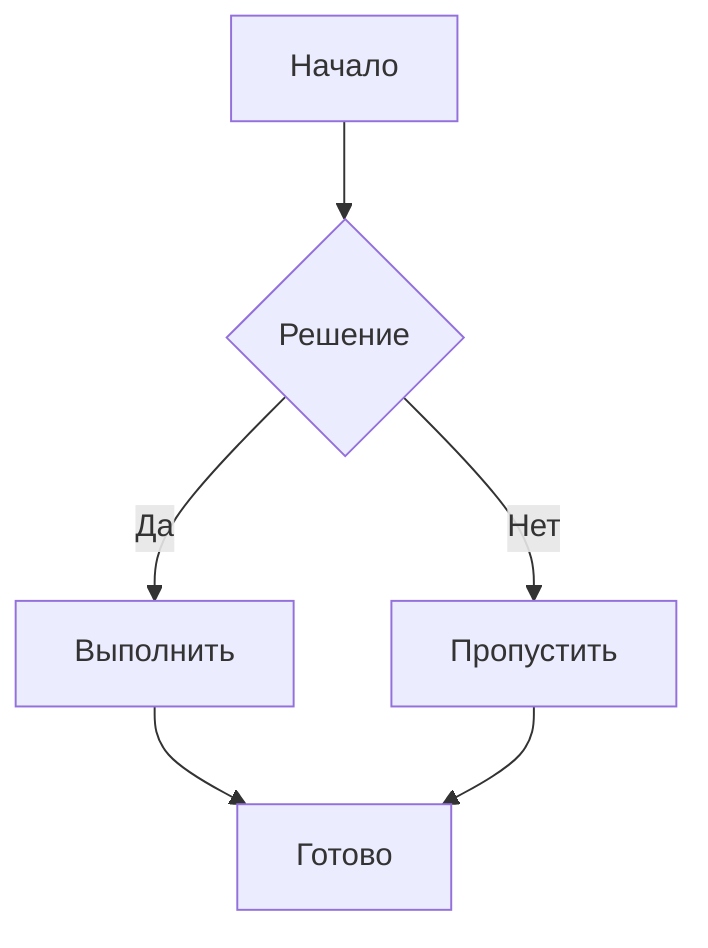
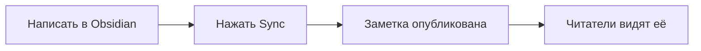
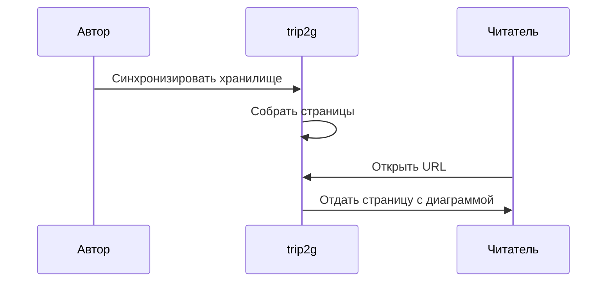
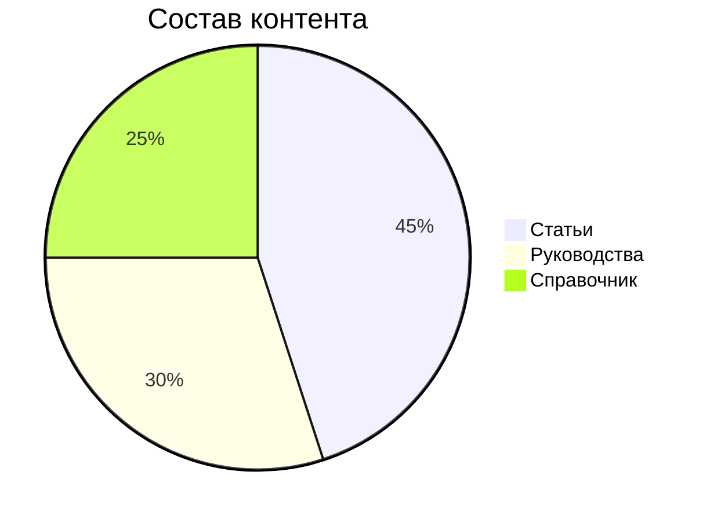

Блок `mermaid` в заметке превращается в диаграмму на опубликованной странице. Пишите диаграммы так же, как в [Obsidian](https://help.obsidian.md/Editing+and+formatting/Advanced+formatting+syntax#Diagram).

## Как использовать

Добавьте в заметку блок кода с идентификатором `mermaid` и вставьте синтаксис диаграммы внутрь:

````

````

Блок отрисуется как диаграмма для каждого читателя, открывшего страницу. Поддерживаются все типы диаграмм Mermaid: блок-схемы, диаграммы последовательности, круговые диаграммы, диаграммы Ганта, классов, состояний и другие.

---

## Примеры

### Блок-схема

````

````


### Диаграмма последовательности

````

````


### Круговая диаграмма

````

````


---

## Производительность

Библиотека Mermaid весит немало. trip2g загружает её лениво — только на страницах, где есть блок `mermaid`. Страницы без диаграмм не платят за это ничем. Так же работает загрузка ECharts для [[ru/user/chartdata|графиков datachart]].

Отрисовка происходит в браузере читателя.

---

## Типы диаграмм

Работает любой тип из [документации Mermaid](https://mermaid.js.org/intro/):

| Тип | Ключевое слово |
|-----|---------------|
| Блок-схема | `graph` / `flowchart` |
| Диаграмма последовательности | `sequenceDiagram` |
| Круговая диаграмма | `pie` |
| Диаграмма Ганта | `gantt` |
| Диаграмма классов | `classDiagram` |
| Диаграмма состояний | `stateDiagram-v2` |
| ER-диаграмма | `erDiagram` |
| Путь пользователя | `journey` |

Полный справочник синтаксиса — на [mermaid.js.org](https://mermaid.js.org/intro/).
