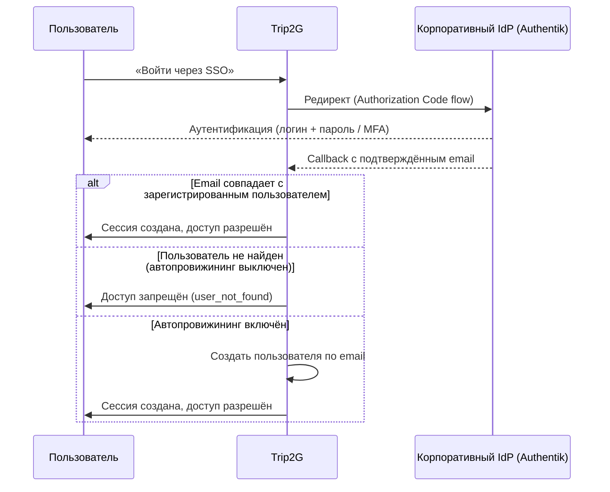

OIDC позволяет сотрудникам входить в trip2g через корпоративный аккаунт — один клик через корпоративный IdP, без отдельного пароля в trip2g. Основной IdP в фокусе — **Authentik**, но подойдёт любой провайдер со стандартным OpenID Connect.

## Как это работает

OIDC не даёт доступ автоматически. Доступ зависит от того, совпадает ли email из IdP с email зарегистрированного пользователя в trip2g — если не включён автопровижининг.

Два шага в строгом порядке:

1. **Пользователь нажимает «Войти через SSO»** — браузер уходит на IdP, где человек проходит аутентификацию; IdP возвращает подтверждённый email.
2. **trip2g проверяет email** — если он совпадает с зарегистрированным пользователем, сессия создаётся; если нет, доступ закрыт (или пользователь создаётся автоматически при включённом автопровижининге).



После активации OIDC-провайдера кнопка **«Войти через SSO»** появляется на странице входа. Callback-адрес, по которому IdP возвращает пользователя:

```
https://ваш-домен.com/_system/auth/oidc/callback
```

Зарегистрируйте этот адрес в IdP точно в таком виде.

## Настройка IdP (Authentik)

Эти шаги выполняет администратор Authentik один раз.

### Шаг 1. Создайте Provider

1. В Authentik перейдите в **Applications → Providers → Create**.
2. Выберите **OAuth2/OpenID Provider**.
3. Заполните форму:
   - **Name**: например, `trip2g`
   - **Authorization flow**: стандартный flow вашей организации
   - **Client type**: Confidential
   - **Redirect URIs**: добавьте точно `https://ваш-домен.com/_system/auth/oidc/callback`
4. Сохраните. Authentik создаст **Client ID** и **Client Secret** — скопируйте оба значения.

### Шаг 2. Создайте Application

1. Перейдите в **Applications → Applications → Create**.
2. Свяжите Application с созданным Provider.
3. **Slug приложения** войдёт в URL issuer'а:
   ```
   https://authentik.company/application/o/<slug>/
   ```
   Примечание: закрывающий слеш обязателен — Authentik включает его в claim `iss`.

### Шаг 3. (Необязательно) Добавьте группы в токен

По умолчанию Authentik не включает группы в токен. Чтобы добавить claim `groups`:

1. Перейдите в **Customization → Property Mappings → Create → OAuth2 Scope Mapping**.
2. Укажите **Scope name**: `groups`.
3. Добавьте выражение:
   ```python
   return [group.name for group in request.user.ak_groups.all()]
   ```
4. Привяжите это mapping к Provider в разделе **Advanced protocol settings → Scopes**.
5. При настройке OIDC-провайдера в trip2g добавьте `groups` в поле Scopes.

## Настройка OIDC в trip2g

Провайдер можно добавить двумя способами в зависимости от типа деплоя.

### Способ А: Через администраторскую панель (runtime)

Подходит для стандартных деплоев, где администратор управляет ключами через интерфейс.

1. Войдите в административную панель trip2g.
2. Перейдите в **Admin → OIDC** и создайте провайдер, заполнив поля:

   | Поле | Пример значения |
   |---|---|
   | Name | `Authentik` |
   | Issuer | `https://authentik.company/application/o/trip2g/` |
   | Client ID | из Authentik |
   | Client Secret | из Authentik |
   | Scopes | `openid email profile` (добавьте `groups`, если настроили) |

3. Сохраните, затем сделайте провайдер **активным**.

После активации на странице входа появится кнопка **«Войти через SSO»**.

### Способ Б: Через переменные окружения (self-hosted, zero-touch)

Подходит для корпоративных деплоев, где SSO-конфигурацию нужно зафиксировать на уровне инфраструктуры и защитить от изменения через панель.

Установите переменные окружения перед запуском trip2g:

```bash
OIDC_ISSUER="https://authentik.company/application/o/trip2g/"
OIDC_CLIENT_ID="<client_id из Authentik>"
OIDC_CLIENT_SECRET="<client_secret из Authentik>"
```

Дополнительные переменные:

```bash
OIDC_AUTO_PROVISION="true"                 # создавать пользователей при первом входе
OIDC_ALLOWED_EMAIL_DOMAIN="company.com"    # пускать только с этим доменом email
OIDC_REQUIRED_GROUP="trip2g-users"         # пускать только членов этой группы
```

Пока эти переменные заданы, trip2g использует **провайдер, управляемый через env**, собранный прямо из них, — он всегда имеет приоритет над тем, что настроено в панели. Этот провайдер **заблокирован**: его нельзя изменить или удалить из панели, такие попытки просто игнорируются. Чтобы отключить его, уберите переменные и перезапустите.

## Политика доступа

Политика определяет, кого пускать после того, как IdP подтвердил личность.

| Настройка | Поведение |
|---|---|
| `auto_provision` выключен (по умолчанию) | Email из IdP должен совпадать с email существующего пользователя trip2g. Незнакомый email — доступ закрыт. Аналогично поведению Google/GitHub OAuth. |
| `auto_provision` включён | При первом входе trip2g создаёт нового пользователя по подтверждённому email. |
| `email_verified` | Для каждого входа нужен подтверждённый email. Если claim есть в UserInfo, он приоритетен; подписанный и проверенный ID token используется только при отсутствии claim в UserInfo. |
| `allowed_email_domain` | Каждый вход (существующего или нового пользователя) блокируется, если домен email не совпадает с указанным. |
| `required_group` | Каждый вход блокируется, если в токене нет нужной группы. Требует scope mapping `groups` в Authentik. |

Ограничения по домену и группам применяются при каждом входе, не только при первом.

### Точный механизм проверки email

Сначала trip2g проверяет подпись ID token, issuer, audience, срок действия, nonce и `iat` при его наличии, затем требует, чтобы непустой `sub` из ID token точно совпадал с `sub` из UserInfo. После этого требуется непустой email в UserInfo, и до любого поиска локального аккаунта применяется следующая таблица:

| `email_verified` в UserInfo | Проверенный ID token | Результат |
|---|---|---|
| `true` | Любое значение или claim отсутствует | Вход разрешён; источник подтверждения — UserInfo. |
| `false` | Даже `true` | Отказ `email_not_verified`; явный запрет UserInfo никогда не включает fallback. |
| Claim отсутствует | `email_verified: true`, а непустой email ID token точно равен email UserInfo | Вход разрешён; источник подтверждения — ID token. |
| Claim отсутствует | Claim отсутствует/`null`/`false`, email ID token пуст или email не совпадает | Отказ `email_not_verified`. |
| `null` | Любое значение | Отказ `email_not_verified`; `null` не считается отсутствующим claim. |
| Не boolean | Любое значение | Некорректный ответ провайдера отклоняется с `oauth_failed`. |

При fallback email сравниваются побайтно: trip2g не удаляет пробелы и не меняет регистр. Сравнение `sub` связывает ID token и UserInfo только в рамках текущего callback. Локальный аккаунт по-прежнему ищется по email; постоянной привязки аккаунта к `(issuer, sub)` пока нет.

## Безопасность

При Способе А Client Secret хранится в базе в зашифрованном виде — даже если резервная копия попадёт в чужие руки, без ключа шифрования секрет недоступен. При Способе Б секрет живёт только в переменных окружения и никогда не записывается в базу.

Провайдер, управляемый через env (Способ Б), нельзя случайно изменить или деактивировать через административную панель.

## Связанные статьи

- [[ru/user/oauth]] — OAuth-авторизация через Google и GitHub
- [[ru/user/user_management]] — добавление пользователей и назначение ролей
- [[ru/user/monetization]] — разграничение публичных и платных материалов
- [[ru/user/advanced]] — свой домен, SEO и другие настройки хостинга
