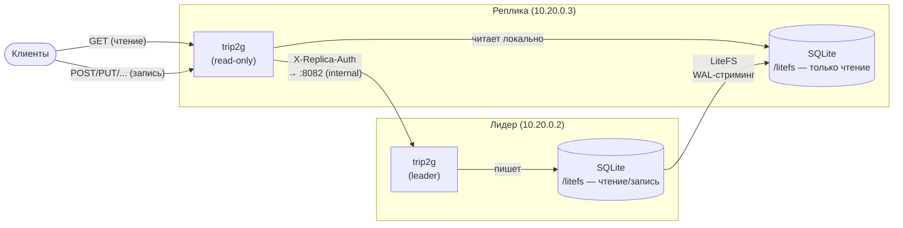

**Коротко:** задайте `TRIP2G_LEADER_ADDR` на втором сервере. Этот сервер отдаёт все GET-запросы локально из SQLite-базы, реплицированной через LiteFS, и проксирует любой мутирующий запрос на лидера. Чтение быстрое, записи всегда согласованы. Проверено на двух виртуалках Hetzner: 60/60 читающих запросов прошли успешно во время перезапуска первичного сервера.

---

Read-реплика разделяет нагрузку: второй экземпляр trip2g обслуживает публичное чтение локально, а первичный сервер принимает все записи. Это снижает задержку чтения, снимает нагрузку с первичного и позволяет перезапускать его без прерывания читателей. Смотрите также [[ru/user/zerodowntime]] и [[ru/user/litestream]].

## Как это работает



_Реплика отдаёт GET локально; записи перенаправляются лидеру через приватную сеть. LiteFS стримит изменения SQLite обратно на реплику._

Три компонента работают вместе.

**LiteFS** стримит каждую SQLite-запись с первичного на реплику на уровне файловой системы. Монтирование `/litefs` на реплике доступно только для чтения; каждая WAL-страница, которую закоммитил первичный, появляется на реплике за единицы миллисекунд (медиана 9 мс на нашем стенде). Приложение на реплике читает из этой локальной копии: без обращений к S3, без сетевого вызова на первичный.

**Режим только для чтения** (переменная `TRIP2G_LEADER_ADDR` задана) меняет поведение trip2g при старте: пропускает миграции, открывает SQLite с прагмой `query_only` (случайная запись сразу даёт ошибку, а не портит базу), не запускает фоновые воркеры, очереди и крон-задачи.

**Проксирование записей.** Когда реплика получает мутирующий запрос (POST, PUT, PATCH, DELETE), она пересылает его целиком на внутренний HTTP-адрес лидера, ждёт ответа и возвращает его клиенту без изменений. Решение принимается по HTTP-методу до входа в любой обработчик, поэтому ни одно побочное действие не выполняется дважды.

Безопасность: каждый проксируемый запрос несёт заголовок `X-Replica-Auth` (HMAC, подписанный общим `TRIP2G_JWT_SECRET`, действительный 30 секунд). Лидер принимает форвардированные записи только на внутреннем порту (`TRIP2G_INTERNAL_LISTEN_ADDR`), привязанном к приватному сетевому интерфейсу. Запросы без корректного `X-Replica-Auth` получают 401.

> **Примечание про GraphQL:** GraphQL-запросы используют HTTP POST, поэтому они тоже идут на лидера. Это даёт всегда свежие данные для низконагруженного admin API. Высоконагруженный путь публичных страниц (HTTP GET) обслуживается локально на реплике.

## Что понадобится

- Два сервера в одной приватной сети (в примерах используется приватная сеть Hetzner: первичный `10.20.0.2`, реплика `10.20.0.3`)
- Бинарник `litefs` на обоих серверах (`/usr/local/bin/litefs`)
- Бинарник `trip2g` на обоих серверах

Важно: Litestream (непрерывный S3-бэкап) и LiteFS (живая репликация) являются разными инструментами, работающими с одним WAL. Если нужны оба, запускайте Litestream на отдельном первичном, не на LiteFS-монтировании. Подробнее в [[ru/user/litestream]] и [[ru/user/backup]].

## Шаг 1: установка LiteFS

Разместите бинарник `litefs` в `/usr/local/bin/litefs` на обоих серверах.

Создайте директории:

```sh
mkdir -p /litefs /var/lib/litefs
```

`/litefs` является FUSE-монтированием, которое видит приложение. `/var/lib/litefs` хранит внутреннее состояние LiteFS (LTX-страницы). В `/litefs` могут лежать только SQLite-файлы баз данных.

### Первичный: `/etc/litefs.yml`

```yaml
# litefs.primary.yml — сохраните как /etc/litefs.yml на первичном

fuse:
  # Куда приложение открывает базу. trip2g открывает /litefs/data.sqlite3.
  # На первичном это монтирование доступно на запись.
  dir: "/litefs"

data:
  # Внутреннее состояние LiteFS. Разместите на постоянном томе.
  dir: "/var/lib/litefs"

# Привяжите LiteFS API на всех интерфейсах (по умолчанию только localhost),
# чтобы реплика могла достучаться. Файрвол закрывает :20202 от публичного доступа.
http:
  addr: ":20202"

lease:
  type: "static"
  # URL LiteFS API этого узла. Репликы подключаются сюда для стриминга.
  # Используйте приватный интерфейс — репликация не должна идти через публичную сеть.
  advertise-url: "http://10.20.0.2:20202"
  # candidate: true — этот узел является первичным.
  candidate: true
```

### Реплика: `/etc/litefs.yml`

```yaml
# litefs.replica.yml — сохраните как /etc/litefs.yml на реплике

fuse:
  dir: "/litefs"

data:
  dir: "/var/lib/litefs"

lease:
  type: "static"
  # advertise-url указывает на ПЕРВИЧНЫЙ (не на этот узел).
  # Реплика стримит базу данных с API первичного.
  advertise-url: "http://10.20.0.2:20202"
  # candidate: false — этот узел всегда реплика только для чтения.
  candidate: false
```

### Systemd-юнит (одинаковый на обоих узлах): `/etc/systemd/system/litefs.service`

```ini
[Unit]
Description=LiteFS distributed SQLite
After=network-online.target
Wants=network-online.target

[Service]
Type=simple
ExecStart=/usr/local/bin/litefs mount
ExecStopPost=/bin/fusermount -uz /litefs
Restart=on-failure
RestartSec=2
LimitNOFILE=65536

[Install]
WantedBy=multi-user.target
```

Единственное различие между узлами: `/etc/litefs.yml`. Systemd-юнит идентичен.

## Шаг 2: настройка trip2g

Собирайте бинарник локально и передавайте на серверы; на сервере не собирайте:

```sh
make build-amd64
scp ./tmp/amd64 root@10.20.0.2:/usr/local/bin/trip2g
scp ./tmp/amd64 root@10.20.0.3:/usr/local/bin/trip2g
```

### Первичный: `/etc/trip2g.env`

```sh
TRIP2G_DB_FILE=/litefs/data.sqlite3
TRIP2G_LISTEN_ADDR=:8081

# Внутренний порт: health/metrics И точка приёма записей от реплик.
# Привяжите к приватному интерфейсу — публичный доступ недопустим.
TRIP2G_INTERNAL_LISTEN_ADDR=10.20.0.2:8082

# Общий с репликой. Также подписывает HMAC-токены X-Replica-Auth.
TRIP2G_JWT_SECRET=ваш-общий-секрет
TRIP2G_DATA_ENCRYPTION_KEY=0123456789abcdef0123456789abcdef  # ровно 32 байта

TRIP2G_OWNER_EMAIL=admin@example.com
TRIP2G_PUBLIC_URL=https://yourdomain.com

TRIP2G_MINIO_ENDPOINT=10.20.0.2:9000
TRIP2G_MINIO_ACCESS_KEY_ID=your-key
TRIP2G_MINIO_SECRET_KEY=your-secret
TRIP2G_MINIO_BUCKET=trip2g-backups
```

Важные моменты:
- Переменная для файла БД: `TRIP2G_DB_FILE` (флаг `--db-file`), не `TRIP2G_DATABASE_FILE`.
- `TRIP2G_INTERNAL_LISTEN_ADDR` должен быть привязан к приватному интерфейсу. Именно на него реплика проксирует записи.
- `TRIP2G_DATA_ENCRYPTION_KEY`: ровно 32 байта.

### Реплика: `/etc/trip2g.env`

```sh
TRIP2G_DB_FILE=/litefs/data.sqlite3
TRIP2G_LISTEN_ADDR=:8081
TRIP2G_INTERNAL_LISTEN_ADDR=:8082

# Эта одна переменная включает режим read-only реплики.
# Укажите ВНУТРЕННИЙ адрес лидера (приватный интерфейс, plain HTTP).
TRIP2G_LEADER_ADDR=10.20.0.2:8082

# Должны совпадать с лидером точно — общая БД + подпись X-Replica-Auth.
TRIP2G_JWT_SECRET=ваш-общий-секрет
TRIP2G_DATA_ENCRYPTION_KEY=0123456789abcdef0123456789abcdef

TRIP2G_OWNER_EMAIL=admin@example.com
TRIP2G_PUBLIC_URL=https://replica.yourdomain.com

TRIP2G_MINIO_ENDPOINT=10.20.0.2:9000
TRIP2G_MINIO_ACCESS_KEY_ID=your-key
TRIP2G_MINIO_SECRET_KEY=your-secret
TRIP2G_MINIO_BUCKET=trip2g-backups
```

`TRIP2G_LEADER_ADDR` является единственным переключателем режима read-only. Если переменная задана, включается режим только для чтения.

### Systemd-юнит (одинаковый на обоих узлах): `/etc/systemd/system/trip2g.service`

```ini
[Unit]
Description=trip2g
After=litefs.service network-online.target
Requires=litefs.service
Wants=network-online.target

[Service]
Type=simple
EnvironmentFile=/etc/trip2g.env
# WorkingDirectory — обычная директория с правом записи.
# Никогда не указывайте /litefs: FUSE-монтирование принимает только SQLite-файлы.
# gitapi создаёт поддиректорию tmp/ и упадёт на FUSE-монтировании.
WorkingDirectory=/var/lib/trip2g
ExecStart=/usr/local/bin/trip2g
Restart=on-failure
RestartSec=2
KillSignal=SIGTERM
TimeoutStopSec=20
LimitNOFILE=65536

[Install]
WantedBy=multi-user.target
```

Создайте рабочую директорию перед запуском:

```sh
mkdir -p /var/lib/trip2g
```

## Шаг 3: порядок запуска

Сначала запустите первичный. trip2g на первичном применяет миграции и создаёт базу данных. Затем запустите реплику: LiteFS реплицирует базу до того, как trip2g стартует.

```sh
# На первичном
systemctl enable --now litefs
systemctl enable --now trip2g

# Подождите ~5 секунд, чтобы LiteFS реплицировал БД на реплику, затем:

# На реплике
systemctl enable --now litefs
systemctl enable --now trip2g
```

trip2g на реплике ждёт появления `/litefs/data.sqlite3` (гарантируется через `Requires=litefs.service`) перед открытием базы.

## Проверка

Все команды ниже выполнялись на тестовом стенде из двух виртуалок Hetzner (первичный `10.20.0.2`, реплика `10.20.0.3`).

**Реплика жива:**

```sh
curl -s http://10.20.0.3:8082/livez
# 200 OK

curl -s -o /dev/null -w "%{http_code}" http://10.20.0.3:8081/
# 200
```

**Паритет чтения.** Лидер и реплика возвращают одинаковое содержимое:

```sh
curl -s http://10.20.0.2:8081/ | wc -c   # 43979
curl -s http://10.20.0.3:8081/ | wc -c   # 43979
```

**Проксирование записей.** POST на реплику выполняется на лидере и возвращается обратно:

```sh
curl -s -X POST \
  -H "Content-Type: application/json" \
  -d '{"query":"{__typename}"}' \
  http://10.20.0.3:8081/_system/graphql
# {"data":{"__typename":"Query"}}
```

**Аутентификация.** Прямой POST на внутренний порт лидера без заголовка даёт 401:

```sh
curl -s -o /dev/null -w "%{http_code}" \
  -X POST -d '{"query":"{__typename}"}' \
  http://10.20.0.2:8082/_system/graphql
# 401
```

**Задержка репликации.** Запись на лидере, проверка на реплике:

```sh
# Запись на первичном — проверяем появление на реплике. При корректном замере
# (реплика опрашивает БД ещё до записи, часы синхронизированы по NTP, 12 записей)
# задержка репликации составила: мин 6 мс, медиана 9 мс, макс 12 мс —
# единицы миллисекунд в приватной сети.
cat /litefs/.lag   # на реплике; текущее отставание по данным LiteFS
```

**Защита от записи.** Прямая запись в FUSE-монтирование реплики завершается ошибкой:

```sh
sqlite3 /litefs/data.sqlite3 "INSERT INTO notes(id) VALUES(1);"
# Error: disk I/O error (read-only filesystem)
```

**Zero-downtime.** Перезапуск лидера при активном чтении с реплики:

```sh
# 60 GET-запросов к реплике во время перезапуска лидера:
for i in $(seq 1 60); do
  curl -s -o /dev/null -w "%{http_code}\n" http://10.20.0.3:8081/
done | sort | uniq -c
# 60 200
# 0 не-200
```

Все 60 запросов прошли успешно. Реплика не прерывала обслуживание. Подробнее про процедуру деплоя: [[ru/user/zerodowntime]].

## Тестирование с лидером и двумя репликами

Одной реплики достаточно для большинства задач. Две реплики проверяют, что схема масштабируется горизонтально: каждая дополнительная реплика является ещё одним процессом trip2g, указывающим на того же лидера.

### Как добавить вторую реплику

Второй реплике нужны три вещи, которые отличают её от первой:

- другие порты на хосте (чтобы обе могли работать на одной машине в тесте или на отдельных VM в продакшне)
- своё имя куки (`TRIP2G_SESSION_COOKIE_NAME`) во избежание конфликтов сессий
- своя рабочая директория для git-реплики (`WorkingDirectory` или `TRIP2G_GIT_REPLICA_PATH`)

Всё остальное (`TRIP2G_LEADER_ADDR`, `TRIP2G_JWT_SECRET`, `TRIP2G_DATA_ENCRYPTION_KEY`, путь к SQLite) идентично первой реплике. Реплики не координируются между собой; каждая проксирует записи на лидера независимо.

В e2e-стенде Docker Compose две реплики определены так:

| Сервис | Публичный порт | Внутренний порт | Имя куки |
|---|---|---|---|
| `app-replica` | 20071 (HTTP), 20072 (internal) | — | `session_r1` |
| `app-replica2` | 20073 (HTTP), 20074 (internal) | — | `session_r2` |

Обе задают `LEADER_ADDR=app:20082` и разделяют SQLite-данные лидера через bind-mount. У каждой свой путь для git-реплики. Обе открывают `/livez` для проверки доступности.

### Что проверяет e2e-сюита

Спецификация `e2e/read-replica.spec.js` описывает общую тестовую сюиту и прогоняет её против URL каждой реплики по очереди: 5 тестов на реплику, 10 итого. Все 10 прошли, 0 упало.

Проверки для каждой реплики:

1. `GET /` возвращает 200: реплика отдаёт чтение локально, не обращаясь к лидеру.
2. `/livez` возвращает alive.
3. GraphQL-запись (POST) проксируется на лидера и применяется; ответ возвращается через реплику.
4. Прямой POST на внутренний порт лидера **без** заголовка `X-Replica-Auth` с HMAC → 401. Точка приёма записей проверяет аутентификацию; запросы без валидного заголовка отклоняются.
5. После записи через реплику данные доступны для чтения: репликация успела применить изменение.

Четвёртый пункт стоит выделить отдельно: внутренний порт лидера не является публичной точкой записи. Любой клиент, который минует реплику и пишет напрямую на `:8082` без корректного HMAC, получает 401. Это требование соблюдается независимо от того, какая реплика пересылала запросы.

### Исправленная ошибка

При добавлении второй реплики на старте появлялся краш: трекер 404-ошибок запускал фоновую горутину с записью в базу ещё до того, как срабатывала защита read-replica. На реплике SQLite открыт с прагмой `query_only`, поэтому горутина немедленно падала в панику.

Исправление: эта фоновая горутина пропускается, если задан `TRIP2G_LEADER_ADDR`. Трекинг 404-ошибок на реплике не нужен, так как записи всё равно идут на лидера.

## Компромиссы

**Задержка репликации:** запись, проксированная репликой (сессия входа, публикация заметки), попадёт в локальное чтение реплики в течение долей секунды. Если сразу прочитать эти данные с реплики, можно увидеть состояние до записи. Для публичного чтения это приемлемо. Для транзакционных потоков (вход → немедленный редирект) лидер и так обрабатывает и запись, и последующий ответ.

**GraphQL-запросы и мутации:** GraphQL использует HTTP POST, поэтому весь GraphQL-трафик (и запросы, и мутации) идёт на лидера. Это даёт всегда свежие данные для admin API ценой отправки низконагруженных GraphQL-чтений по внутренней сети. Высоконагруженный путь публичного контента (GET) остаётся полностью локальным на реплике.

**Статическая аренда, без автоматического переключения:** `candidate: false` означает, что реплика никогда не становится первичным. Это сделано намеренно для простой схемы из двух узлов. Если первичный недоступен, реплика продолжает отдавать чтение, но проксирование записей не работает до восстановления первичного.

Смотрите также [[ru/user/backup]], [[ru/user/litestream]], [[ru/user/zerodowntime]].
