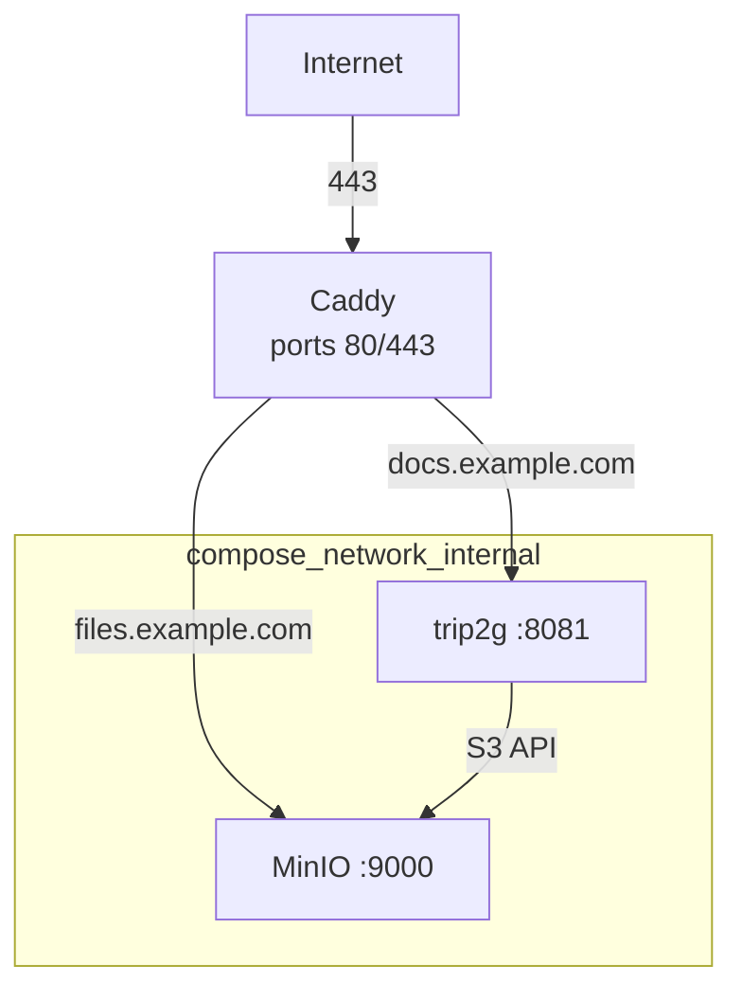

Три способа запустить trip2g на своём сервере. Выберите подходящий.

[★ GitHub — github.com/trip2g/trip2g](https://github.com/trip2g/trip2g)

| Вариант | Подходит когда |
|---|---|
| **Один бинарник на Linux** | Один сайт, одна VM. Без Docker, без Caddy, без MinIO. HTTPS встроен через Let's Encrypt. |
| **Docker Compose (полный стек)** | Нужны S3-совместимое хранилище и reverse proxy в одной конфигурации. |
| **fly.io** | Managed PaaS, без своего сервера. См. [[ru/user/fly]]. |

---

## Один бинарник на Linux

Один бинарник, один systemd-юнит, HTTPS из коробки. Docker не нужен.

Бинарник `trip2g` содержит все frontend-ассеты внутри. На хосте нужны только `git` и `ca-certificates`.

### Получите бинарник

Три способа — в порядке предпочтения:

**(а) Скачать с GitHub Releases** (рекомендуется):

```bash
# Замените <version> на актуальный тег с https://github.com/trip2g/trip2g/releases
curl -L https://github.com/trip2g/trip2g/releases/download/<version>/trip2g_<version>_linux_amd64.tar.gz \
  | tar xz trip2g
sudo mv trip2g /usr/local/bin/trip2g
sudo chmod +x /usr/local/bin/trip2g
```

**(б) Извлечь из Docker-образа**:

```bash
docker create --name tmp ghcr.io/trip2g/trip2g && \
  docker cp tmp:/trip2g /usr/local/bin/trip2g && \
  docker rm tmp
sudo chmod +x /usr/local/bin/trip2g
```

**(в) Собрать из исходников** — важно: фронтенд должен быть уже собран в `assets/ui` до сборки (в `Dockerfile` это делает сборщик `$mol`). Варианты (а) и (б) самодостаточны; (в) — только для полного чекаута с собранным фронтендом:

```bash
GOOS=linux GOARCH=amd64 CGO_ENABLED=0 go build ./cmd/server
sudo mv server /usr/local/bin/trip2g
sudo chmod +x /usr/local/bin/trip2g
```

### Установите зависимости

```bash
apt-get update && apt-get install -y git ca-certificates
```

Бинарник вызывает `git` внутри себя и использует CA-сертификаты для проверки TLS.

### Создайте директории для данных

```bash
mkdir -p /var/lib/trip2g/storage
```

### Настройте конфигурацию

Создайте файл `/etc/trip2g.env` и ограничьте доступ к нему:

```bash
touch /etc/trip2g.env
chmod 600 /etc/trip2g.env
```

Вставьте и заполните значения:

```dotenv
ACME_DOMAIN=docs.example.com
PUBLIC_URL=https://docs.example.com
INTERNAL_LISTEN_ADDR=:8082
DB_FILE=/var/lib/trip2g/data.sqlite3
GIT_API_REPO_PATH=/var/lib/trip2g/git
STORAGE_BACKEND=local
STORAGE_LOCAL_DIR=/var/lib/trip2g/storage
LOG_LEVEL=info
DEV=false
OWNER_EMAIL=owner@example.com
JWT_SECRET=<openssl rand -hex 32>
DATA_ENCRYPTION_KEY=<openssl rand -hex 16>
SMTP_HOST=smtp.resend.com
SMTP_USER=resend
SMTP_PASS=<resend api key>
MAIL_FROM=no-reply@your-verified-domain
```

Что означает каждая настройка:

- `ACME_DOMAIN` — домен для получения сертификата Let's Encrypt. Бинарник слушает `:443` (TLS-ALPN-01) и делает HTTP→HTTPS редирект на `:80`. Caddy не нужен.
- `PUBLIC_URL` — внешний адрес сайта. Используется в ссылках и email-флоу.
- `INTERNAL_LISTEN_ADDR` — внутренний адрес для healthcheck (`/healthz`).
- `DB_FILE` — путь к SQLite-базе.
- `GIT_API_REPO_PATH` — путь к внутреннему bare git-репозиторию trip2g.
- `STORAGE_BACKEND=local` — хранит загруженные файлы на диске в `STORAGE_LOCAL_DIR`. trip2g отдаёт их сам по пути `/_assets/...`. Чтобы позже переключиться на S3, используйте те же переменные `MINIO_*`, что и в Compose-варианте.
- `LOG_LEVEL` — уровень логов. `info` — хорошо для production.
- `DEV=false` — production-режим (secure cookies, без debug-вывода).
- `OWNER_EMAIL` — email владельца инстанса.
- `JWT_SECRET` — секрет для подписи сессионных токенов. После смены все старые сессии станут недействительными.
- `DATA_ENCRYPTION_KEY` — 32-символьный ключ для шифрования чувствительных данных. `openssl rand -hex 16` выдаёт ровно 32 символа.
- `SMTP_HOST` / `SMTP_USER` / `SMTP_PASS` — параметры SMTP. В примере используется шлюз Resend (`smtp.resend.com`, пользователь `resend`, пароль = API key). Без настроенного SMTP сервер запустится, но коды входа будут отображаться только в логах — удобно для первоначальной проверки.
- `MAIL_FROM` — адрес отправителя. Должен принадлежать домену, подтверждённому в почтовом провайдере.

**Требования ACME**: до запуска сервиса DNS A/AAAA запись домена должна указывать на этот сервер, порты `80` и `443` должны быть открыты. Для быстрой проверки без собственного домена подойдёт wildcard DNS вроде `<ip>.nip.io`.

Сгенерируйте секреты заранее:

```bash
openssl rand -hex 32   # JWT_SECRET
openssl rand -hex 16   # DATA_ENCRYPTION_KEY (ровно 32 символа)
```

### Создайте systemd-юнит

Создайте файл `/etc/systemd/system/trip2g.service`:

```ini
[Unit]
Description=trip2g publishing server
After=network.target

[Service]
Type=simple
EnvironmentFile=/etc/trip2g.env
ExecStart=/usr/local/bin/trip2g
WorkingDirectory=/var/lib/trip2g
Restart=on-failure

[Install]
WantedBy=multi-user.target
```

Юнит запускается от root, чтобы бинарник мог занять порты `80` и `443`.

### Запустите и проверьте

```bash
systemctl daemon-reload
systemctl enable --now trip2g
```

Проверьте статус:

```bash
systemctl is-active trip2g
journalctl -u trip2g -f
```

Проверьте HTTPS:

```bash
curl -I https://docs.example.com/
```

Ожидаемый результат: `HTTP/2 200` с сертификатом Let's Encrypt.

После этого откройте `https://docs.example.com`, войдите под `OWNER_EMAIL` и продолжайте в [[ru/user/Начало работы|Начало работы]].

**Если SMTP не настроен**: коды входа появляются в `journalctl -u trip2g`. Скопируйте код оттуда, чтобы войти.

---

## Docker Compose (полный стек)

trip2g + MinIO (S3-совместимое хранилище) + Caddy в одном `docker-compose.yml`.



### Что важно не забыть

- Для публичного сервера нужен `HTTPS`. Иначе secure-cookie для входа не будет работать.
- Для входа по email нужен аккаунт в `resend.com`, API key и подтвержденный домен или поддомен отправителя.
- Для production обязательно задайте свои `JWT_SECRET` и `DATA_ENCRYPTION_KEY`. Со значениями по умолчанию сервер работает небезопасно.
- Наружу обычно публикуются только `80` и `443` у `caddy`.

### Подготовка

Нужны:

- Linux-сервер с Docker и Docker Compose plugin
- домен для сайта, например `docs.example.com`
- поддомен для email-отправителя, например `mg.example.com`
- доступ к DNS

Создайте директорию, например `/opt/trip2g`, и положите туда два файла: `docker-compose.yml` и `.env`.

### Проверьте сервер перед установкой

Если сервер не чистый, убедитесь до запуска:

- Порты `80` и `443` свободны — compose отдаёт их Caddy:
  ```bash
  ss -tlnp | grep -E ':80 |:443 '
  ```
- Нет другого Caddy, Nginx или Traefik, уже слушающего эти порты. Если есть — его нужно остановить или перенести.
- Нет конфликтующих Docker-сетей от других проектов (редко, но бывает при нестандартном overlay).

Если порты заняты существующим reverse proxy (Nginx, Caddy, Traefik), убирать его не нужно — достаточно прописать trip2g как upstream в нём. Тогда сервис `caddy` из `docker-compose.yml` можно убрать, а порт `8081` опубликовать напрямую. То же самое касается MinIO: если у вас уже есть своё объектное хранилище — MinIO поднимать не нужно, достаточно указать его реквизиты в `.env`.

### `docker-compose.yml`

```yaml
services:
  caddy:
    image: caddy:2
    restart: unless-stopped
    depends_on:
      trip2g:
        condition: service_started
      minio:
        condition: service_healthy
    ports:
      - "80:80"
      - "443:443"
    volumes:
      - ./Caddyfile:/etc/caddy/Caddyfile:ro
      - caddy-data:/data
      - caddy-config:/config

  minio:
    image: minio/minio:latest
    restart: unless-stopped
    command: server /data --console-address ":9001"
    environment:
      MINIO_ROOT_USER: ${MINIO_ROOT_USER}
      MINIO_ROOT_PASSWORD: ${MINIO_ROOT_PASSWORD}
    volumes:
      - minio-data:/data
    expose:
      - "9000"
      - "9001"
    healthcheck:
      test: ["CMD", "curl", "-f", "http://localhost:9000/minio/health/live"]
      interval: 5s
      timeout: 5s
      retries: 20

  trip2g:
    image: ghcr.io/trip2g/trip2g:latest
    restart: unless-stopped
    depends_on:
      minio:
        condition: service_healthy
    env_file:
      - .env
    volumes:
      - trip2g-data:/data
    expose:
      - "8081"
    healthcheck:
      test: ["CMD", "wget", "--no-verbose", "--tries=1", "--spider", "http://localhost:8082/healthz"]
      interval: 10s
      timeout: 5s
      retries: 12
      start_period: 15s

volumes:
  caddy-data:
  caddy-config:
  trip2g-data:
  minio-data:
```

Что здесь важно:

- `caddy` публикует только `80` и `443`.
- `trip2g-data` хранит данные trip2g и внутренний bare git-репозиторий.
- `minio-data` хранит MinIO-объекты.
- `trip2g` и `minio` доступны только внутри compose-сети.

### `.env`

Минимальный `.env` для production:

```dotenv
PUBLIC_URL=https://docs.example.com
LISTEN_ADDR=0.0.0.0:8081
INTERNAL_LISTEN_ADDR=:8082
DB_FILE=/data/data.sqlite3
GIT_API_REPO_PATH=/data/git
LOG_LEVEL=info
DEV=false

OWNER_EMAIL=owner@example.com
MAIL_FROM=no-reply@mg.example.com
RESEND_API_KEY=re_xxxxxxxxx

JWT_SECRET=replace-with-long-random-secret
DATA_ENCRYPTION_KEY=0123456789abcdef0123456789abcdef

MINIO_ROOT_USER=trip2g
MINIO_ROOT_PASSWORD=replace-with-long-random-password
MINIO_ENDPOINT=minio:9000
MINIO_PUBLIC_URL=https://files.example.com
MINIO_ACCESS_KEY_ID=trip2g
MINIO_SECRET_KEY=replace-with-long-random-password
MINIO_BUCKET=trip2g
MINIO_REGION=us-east-1
MINIO_USE_SSL=false
MINIO_INIT_TIMEOUT=30s
MINIO_URL_EXPIRES_IN=10m

SIMPLE_BACKUP=true

FEATURES={}

# Для OpenAI embeddings:
# OPENAI_API_KEY=sk-...
# FEATURES={"vector_search":{"enabled":true,"model":"text-embedding-3-small"}}

# Для OpenAI-compatible embeddings API:
# OPENAI_API_KEY=provider-token-if-needed
# FEATURES={"vector_search":{"enabled":true,"model":"bge-m3","base_url":"https://embeddings.example.com/v1"}}
```

### Префикс `TRIP2G_`

По умолчанию trip2g читает конфиг из обычных переменных окружения: `LISTEN_ADDR`, `JWT_SECRET` и т.д.

Если trip2g запускается рядом с другими сервисами, которые используют общий `.env`, можно добавить префикс `TRIP2G_` ко всем переменным trip2g, чтобы не было конфликтов имён:

```dotenv
TRIP2G_PUBLIC_URL=https://docs.example.com
TRIP2G_LISTEN_ADDR=0.0.0.0:8081
TRIP2G_JWT_SECRET=replace-with-long-random-secret
# … и так далее для каждой настройки
```

Если переменная с префиксом `TRIP2G_` присутствует, она имеет приоритет над одноимённой без префикса. Любая `TRIP2G_*` переменная, не соответствующая известной настройке, выводит предупреждение при старте — помогает замечать опечатки, не роняя сервер.

### Что означает каждая настройка

- `PUBLIC_URL` — внешний адрес вашего сайта. Используется в ссылках, email и интеграциях.
- `LISTEN_ADDR` — адрес, на котором слушает основной HTTP-сервер.
- `INTERNAL_LISTEN_ADDR` — внутренний адрес для healthcheck и служебных endpoint'ов.
- `DB_FILE` — путь к файлу данных внутри контейнера.
- `GIT_API_REPO_PATH` — путь к встроенному git-репозиторию trip2g.
- `LOG_LEVEL` — уровень логов сервера.
- `DEV=false` — production-режим. Не включайте `DEV=true` на публичном сервере.
- `OWNER_EMAIL` — email владельца инстанса.
- `MAIL_FROM` — адрес отправителя. Он должен принадлежать домену, который вы подтвердили в Resend.
- `RESEND_API_KEY` — API key для отправки кодов входа по email.
- `JWT_SECRET` — секрет для пользовательских сессий. После смены старые сессии станут недействительными.
- `DATA_ENCRYPTION_KEY` — 32-байтовый ключ для шифрования чувствительных данных. Сгенерировать:
  ```bash
  openssl rand -base64 32 | head -c 32
  ```
- `MINIO_ROOT_USER` / `MINIO_ROOT_PASSWORD` — root-учетка самого MinIO.
- `MINIO_ENDPOINT` — адрес MinIO из контейнера `trip2g`.
- `MINIO_PUBLIC_URL` — публичный адрес MinIO, который попадет в presigned URL для файлов.
- `MINIO_ACCESS_KEY_ID` / `MINIO_SECRET_KEY` — ключи, которыми `trip2g` ходит в MinIO.
- `MINIO_BUCKET` — bucket для ассетов и backup-объектов.
- `MINIO_REGION` — регион S3-совместимого API. Для MinIO обычно оставляют `us-east-1`.
- `MINIO_USE_SSL=false` — между контейнерами обычно не нужен TLS.
- `MINIO_INIT_TIMEOUT` — сколько ждать MinIO на старте.
- `MINIO_URL_EXPIRES_IN` — срок жизни presigned URL для скачивания файлов.
- `SIMPLE_BACKUP=true` — включает простые backup'ы SQLite в MinIO.
- `FEATURES` — JSON-конфиг feature flags. Здесь включается векторный поиск.
- `OPENAI_API_KEY` — ключ для OpenAI или совместимого embeddings API.

Опционально для локального smoke-test без HTTPS:

```dotenv
PUBLIC_URL=http://SERVER_IP:8081
USER_TOKEN_INSECURE=true
```

Но это только для временной проверки. Для публичного сервера оставляйте secure cookies и ставьте TLS.

### Расписание фоновых задач

Фоновые задачи работают по расписанию из таблицы `cron_jobs`; большинство — **каждую минуту**. Чтобы изменить любую задачу, задайте env-переменную с именем задачи — `<JOB_NAME>_SCHEDULE` — и cron-выражением (6 полей, **с ведущим полем секунд**):

```dotenv
# Запускать раз в час вместо каждой минуты
EXECUTE_CRON_WEBHOOKS_SCHEDULE=0 0 * * * *
SEND_SCHEDULED_TELEGRAM_PUBLISHPOSTS_SCHEDULE=0 0 * * * *
```

Имя переменной — это имя задачи в верхнем регистре плюс `_SCHEDULE`. Бóльший интервал означает, что задачи срабатывают менее точно (с задержкой до часа) — в обмен на меньшую нагрузку на базу.

> Инстансы в облаке (managed) по умолчанию запускают их **раз в час**, чтобы не нагружать общую базу. Self-hosted-инстансы сохраняют дефолт «каждую минуту», пока вы не зададите override.

### `Caddyfile`

Если хотите нормальный публичный setup, дайте сайту и файлам отдельные домены:

- `docs.example.com` → trip2g
- `files.example.com` → MinIO

Положите рядом с `docker-compose.yml` файл `Caddyfile`:

```caddyfile
docs.example.com {
	encode zstd gzip
	reverse_proxy trip2g:8081
}

files.example.com {
	encode zstd gzip
	reverse_proxy minio:9000
}

# Опционально, если нужна MinIO console снаружи:
# minio-admin.example.com {
# 	reverse_proxy minio:9001
# }
```

Для такой схемы в `.env` должны совпасть:

```dotenv
PUBLIC_URL=https://docs.example.com
MINIO_PUBLIC_URL=https://files.example.com
```

Зачем это нужно:

- trip2g работает на основном домене;
- ссылки на файлы отдаются с публичного MinIO-домена;
- `caddy` ходит к сервисам по именам `trip2g` и `minio` внутри docker-сети.

### Внешнее объектное хранилище вместо MinIO

По умолчанию MinIO работает на том же сервере, что и trip2g. Это удобно для старта, но не защищает от потери сервера: если диск умрёт, пропадут и файлы, и резервные копии.

Для production рекомендуем вынести хранилище на отдельный S3-совместимый сервис: Backblaze B2, Hetzner Object Storage, Timeweb S3 и другие.

В этом случае сервис `minio` из `docker-compose.yml` можно убрать полностью, а в `.env` указать реквизиты внешнего сервиса:

```dotenv
MINIO_ENDPOINT=s3.us-east-005.backblazeb2.com
MINIO_PUBLIC_URL=https://files.example.com
MINIO_ACCESS_KEY_ID=your-key-id
MINIO_SECRET_KEY=your-secret
MINIO_BUCKET=trip2g
MINIO_REGION=us-east-005
MINIO_USE_SSL=true
```

Тогда `SIMPLE_BACKUP=true` будет складывать резервные копии SQLite уже на внешний сервис — автоматически, без дополнительных усилий и с защитой от потери сервера.

### Репликация SQLite через Litestream

`SIMPLE_BACKUP=true` делает периодические snapshot'ы базы в MinIO. Если нужна непрерывная репликация SQLite с интервалом в 1 секунду, добавьте [Litestream](https://litestream.io).

Litestream запускается на хосте как systemd-сервис и реплицирует файл базы напрямую в S3-совместимое хранилище. В `infra/` уже есть готовая конфигурация:

- `infra/generate-litestream-config.sh` — генерирует `/etc/litestream.yml` из переменных окружения
- `infra/litestream.service` — systemd unit

Конфигурация читает те же переменные, что и `.env` trip2g: `MINIO_ACCESS_KEY_ID`, `MINIO_SECRET_KEY`, `MINIO_ENDPOINT`, `MINIO_BUCKET`, `DB_FILE`. После установки litestream:

```bash
sudo cp infra/generate-litestream-config.sh /usr/local/bin/generate-litestream-config.sh
sudo chmod +x /usr/local/bin/generate-litestream-config.sh
sudo cp infra/litestream.service /etc/systemd/system/litestream.service
sudo systemctl enable --now litestream
```

Litestream и `SIMPLE_BACKUP` можно использовать одновременно — они не конфликтуют. Особенно полезна эта связка с внешним объектным хранилищем: тогда и файлы, и база данных хранятся вне сервера.

### Как создать бесплатный аккаунт Resend

На `resend.com`:

1. Зарегистрируйте бесплатный аккаунт.
2. Добавьте домен или, лучше, поддомен отправителя, например `mg.example.com`.
3. Подтвердите DNS-записи, которые покажет Resend.
4. Создайте API key.
5. Поставьте этот ключ в `RESEND_API_KEY`.
6. Укажите `MAIL_FROM` на адрес внутри подтверждённого домена, например `no-reply@mg.example.com`.

Почему лучше поддомен:

- проще изолировать почтовую репутацию;
- не нужно смешивать транзакционные письма trip2g с основной почтой домена.

Если домен в Resend не подтверждать, письма будут приходить только вам самому. Этого достаточно, если email-вход нужен только владельцу инстанса. Если по email должны входить другие пользователи, домен отправителя нужно подтвердить.

### Векторный поиск через OpenAI или совместимый сервис

По умолчанию trip2g прекрасно работает и без этого. Полнотекстовый поиск останется доступен.

Если нужен семантический поиск:

#### OpenAI

```dotenv
OPENAI_API_KEY=sk-...
FEATURES={"vector_search":{"enabled":true,"model":"text-embedding-3-small"}}
```

Рекомендуемая модель для старта: `text-embedding-3-small`.

#### OpenAI-compatible embeddings API

```dotenv
OPENAI_API_KEY=provider-token-if-needed
FEATURES={"vector_search":{"enabled":true,"model":"bge-m3","base_url":"https://embeddings.example.com/v1"}}
```

Важно: trip2g валидирует имя embedding-модели. Сейчас поддерживаются:

- `text-embedding-3-small`
- `text-embedding-3-large`
- `text-embedding-ada-002`
- `multilingual-e5-base`
- `bge-m3`

То есть «любой OpenAI-compatible сервис» подойдёт только если он умеет отдавать embeddings через совместимый `/v1` API и вы используете одно из поддерживаемых имён моделей.

### Запуск

В директории с `docker-compose.yml`:

```bash
docker compose up -d
```

Если у вас старый синтаксис Compose:

```bash
docker-compose up -d
```

Проверка:

```bash
docker compose ps
docker compose logs -f caddy trip2g
```

После старта:

- откройте `https://docs.example.com`
- войдите по email владельца из `OWNER_EMAIL`
- на пустом инстансе сервис сам предложит ссылку на скачивание ZIP с настроенным vault
- настройте Obsidian plugin на ваш `PUBLIC_URL`

Дальше можно идти в [[ru/user/Начало работы|Начало работы]] и продолжать уже с плагином Obsidian.

### Что ещё легко забыть

- DNS `A`/`AAAA` запись для `PUBLIC_URL`
- DNS `A`/`AAAA` запись для `MINIO_PUBLIC_URL`
- TLS-сертификат на домен сайта
- DNS-записи Resend для домена отправителя
- сохранность volume `trip2g-data`
- не публикуйте MinIO console (`9001`) без необходимости
- мониторинг логов после первого входа и первой отправки письма

Если нужен максимально простой старт, сначала поднимите инстанс без векторного поиска, проверьте вход по email, и только потом добавляйте `FEATURES` для embeddings.

---

## fly.io

Запустите trip2g на fly.io без своего сервера. Полный гайд: [[ru/user/fly]].
