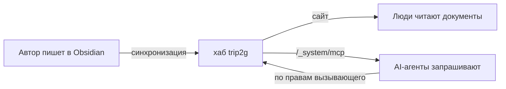

Дайте команде одну базу знаний: люди читают её как сайт, агенты запрашивают по MCP — и то и другое из одних и тех же заметок. Авторы пишут в Obsidian, база стоит на вашем сервере, а доступ ограничен по подписчику, так что агент видит только то, что разрешено его вызывающему. Копия документации никуда не уходит к вендору.

### Проблема: AI выдумывает факты о вашей компании

Ассистент, который не знает ваших внутренних документов, уверенно сочинит и политику, и цены, и процессы. Это не гипотетика — компании уже отвечали за то, что напридумывали их чат-боты. Лечение — заземление: агент должен отвечать из вашей реальной базы знаний, а не из данных обучения.

Обычно это пытаются прикрутить двумя разрозненными системами: вики, которую редактируют люди, и отдельный RAG-конвейер, который затягивает устаревший экспорт в векторную базу для запросов AI. Конвейер расходится с оригиналом. AI отвечает по прошлогодним документам. А модель доступа вики редко переживает копирование, так что агент может показать страницу, которую конкретному пользователю видеть нельзя.

trip2g убирает вторую систему. Заметки, которые редактирует команда, — это и есть то, что запрашивает агент. Ни шага экспорта, ни отдельного индекса для синхронизации, потому что поиск встроен в тот же сервер, который отдаёт страницы.

### MCP против RAG против загрузки файлов

Три частых способа дать агенту ваши документы и когда какой уместен:

| Подход | Что это | Свежесть | Контроль доступа | Когда уместно |
|---|---|---|---|---|
| Загрузка файлов | Вставить или прикрепить документы в чат | Заморожена на момент загрузки | Нет | Разовый вопрос по нескольким файлам |
| Свой RAG-конвейер | Экспорт, эмбеддинги в векторную базу, извлечение | Расходится без переиндексации | Строите сами | Нужен собственный стек извлечения |
| MCP-сервер | Агент вызывает инструменты живой базы | Всегда актуальна | Обеспечивает база | Постоянная база команды, которую агент всегда должен отражать |

trip2g — это строка MCP-сервера: агент запрашивает живую базу, и применяются её собственные права доступа.

### Какую базу знаний выбрать

Если команда уже живёт в Notion или Confluence, их MCP-коннекторы — путь наименьшего сопротивления, признаём это. trip2g подходит команде, которой нужна self-hosted база, написанная в Obsidian, с одними и теми же заметками для людей и агентов:

| База | Хостинг | Написание | Доступ по MCP | Свежесть |
|---|---|---|---|---|
| Notion | SaaS | веб-редактор | официальный коннектор | живая |
| Confluence | SaaS или self-hosted | веб-редактор | официальный коннектор | живая |
| Хранилище Obsidian через trip2g | self-hosted | Obsidian | встроен (`/_system/mcp`) | живая через синхронизацию |
| Свои документы + RAG | ваш | что угодно | строите сами | поддерживаете сами |

### Как это работает

Агент подключается к одному MCP-URL и получает небольшой набор инструментов: `search` (гибридный полнотекстовый плюс семантический), `note_html` для чтения заметки или отдельного раздела, `similar` и `instructions`, которые задаёт автор. Доступ следует за подпиской вызывающего, так что агент, авторизованный как конкретный участник, видит ровно его заметки. Полный справочник инструментов — в [[ru/user/mcp|MCP-сервере]].

### Почему одни и те же заметки для людей и агентов — это важно

- **Нет расхождения.** Отредактировали заметку — следующий запрос агента видит новый текст. Никакой переиндексации.
- **Одна модель прав.** ACL подграфов и подписок управляют и сайтом, и MCP. Правила доступа не нужно вести дважды.
- **Аудируемая память.** Знания — это обычный markdown с историей версий и зеркалом в git. Можно прочитать, сравнить и поправить то, что знает агент.
- **Экономия токенов.** Агенты идут вглубь через `search`, затем `expand`, затем чтение раздела, вместо выгрузки целых заметок. См. [[ru/user/token-economy-bench|бенчмарк экономии токенов]].

### Как настроить

1. Получите инстанс. Разверните [[ru/user/selfhosted|один бинарник или Docker Compose]], чтобы база оставалась внутри вашей инфраструктуры.
2. Положите документы в Obsidian и синхронизируйте. По [[ru/user/Начало работы|началу работы]]. Существующие markdown-документы кладутся напрямую.
3. Настройте доступ. Разложите заметки по подграфам и выдайте доступ участникам; всё без `free: true` остаётся закрытым. Выдачу подписчиков и админов можно скриптовать — см. [[ru/user/user_management|управление пользователями через GraphQL]].
4. Напишите заметку с инструкциями для агента. Заметка с `mcp_method: instructions` говорит агенту, как отвечать из вашей базы. Пример — в [[ru/user/mcp|MCP-сервере]].
5. Включите MCP-сервер в настройках сайта и направьте клиент каждого участника (Claude Code, Claude Desktop, Cursor, Copilot, Gemini CLI) на `https://ваш-хаб/_system/mcp`.
6. Проверьте. Пусть агент вызовет `search` по термину, который точно есть в документах, и прочитает возвращённую заметку. Если ответ со ссылкой — всё подключено верно.

### Контроль доступа, конкретно

Главная тревога любой связки «AI поверх документов» — утечка прав. Здесь доступ не прикручен сбоку:

- Токен обычного пользователя видит только заметки в подграфах, на которые он подписан.
- Заметки в платном или закрытом подграфе даже не появляются в `tools/list` агента, так что премиум-персону можно закрыть подпиской.
- Персональные токены наследуют доступ человека и ничего сверх. Отзыв токена перекрывает доступ за секунды.

Подробности о токенах и уровнях доступа — в [[ru/user/mcp|MCP-сервере]].

### Масштабирование между командами через федерацию

Если две команды держат по хабу, их можно [[ru/user/federation|федерировать]]: один запрос агента веером расходится по обеим базам без слияния систем и без общего хранилища. Каждый хаб по-прежнему сам управляет доступом к своей базе. Это закрывает схемы «компания плюс хабы по командам» и «две организации, один мост» без центрального озера данных.

### Честные компромиссы

- **Вы держите сервер.** Управляемой вики с AI-надстройкой не нужен ops. trip2g — это один бинарник Go на SQLite, но запускать или арендовать его всё равно вам.
- **Авторы пишут в markdown.** Если команда согласна только на веб-редактор WYSIWYG, это реальная цена внедрения. Плюс в том, что документы остаются переносимыми файлами.
- **Семантический поиск требует ключа эмбеддингов.** Полнотекстовый работает из коробки; векторный хочет OpenAI-совместимый эндпоинт (см. [[ru/user/selfhosted|self-hosted]]).

Выбирайте это, когда хотите, чтобы внутренние документы были и читаемыми, и напрямую запрашиваемыми агентами команды, на инфраструктуре, которую контролируете вы, без второго RAG-стека для присмотра.

### Ещё по теме

- [[ru/user/mcp|MCP-сервер]] — инструменты, контроль доступа, токены, свои методы
- [[ru/user/federation|MCP-федерация]] — один запрос веером по хабам-пирам
- [[ru/user/user_management|Управление пользователями через GraphQL]] — заводите участников и подписки из скрипта
- [[ru/user/selfhosted|Self-hosted]] — запустите весь стек внутри своей инфраструктуры
- [[ru/user/token-economy-bench|Бенчмарк экономии токенов]] — почему чтение по разделам снижает стоимость агента
