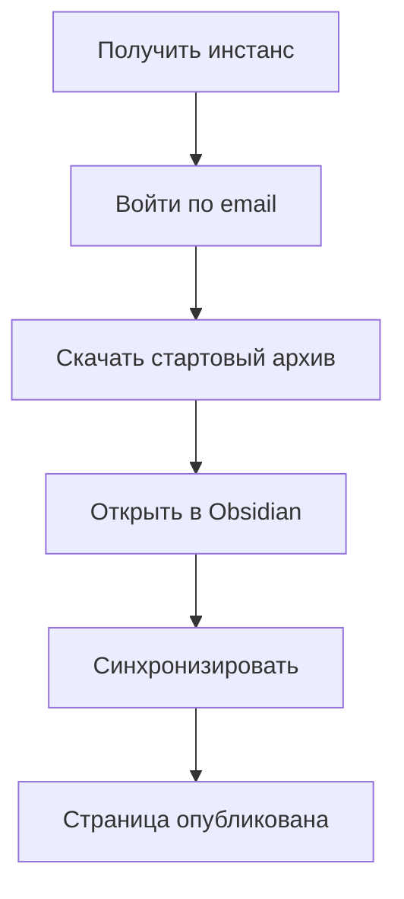

Ваше хранилище Obsidian становится сайтом за минуту. Самый быстрый путь: войдите на свой инстанс, скачайте готовый стартовый архив, откройте его в Obsidian и нажмите синхронизацию. Ничего устанавливать и настраивать не нужно. Попробуйте на [демо](https://simplecloud.2pub.me) или смотрите [[use-cases|примеры использования]].

### Схема запуска

### Как работает сервис

Плагин загружает заметки из выбранной папки хранилища на ваш сайт. По умолчанию все заметки скрыты — только вы видите их, авторизовавшись как администратор. Добавьте `free: true` в frontmatter — и заметка станет видна всем в интернете.

### Вход на сайт

Прежде чем войти, вам нужен инстанс — личный сайт, который уже работает. Смотрите [[hosting|варианты хостинга]], чтобы получить его.

1. Откройте ссылку и нажмите «Вход»
2. Введите email
3. Скопируйте код из письма и вставьте на сайте

Код не пришёл? Проверьте папку «Спам». На self-hosted инстансе без настроенной почты код печатается в логи сервера — выполните `docker compose logs trip2g` и найдите код входа.

### Путь А — стартовый архив (рекомендуем)

Свежий инстанс встречает администратора страницей с кнопкой «Скачать архив». Архив — это готовое хранилище Obsidian: плагин синхронизации уже установлен и подключён, адрес сайта и API-ключ вписаны в настройки.

1. Нажмите «Скачать архив» и распакуйте его
2. В Obsidian выберите «Open folder as vault» и укажите распакованную папку
3. Obsidian спросит, доверять ли хранилищу — выберите «Trust author and enable plugins». Если отказаться, плагин останется выключенным и синхронизация не заработает
4. Нажмите кнопку синхронизации в боковой панели Obsidian

Заметки уже на сайте. Отредактируйте заметку, синхронизируйте, обновите страницу — она изменится.

Два момента:

- **В архиве лежит приватный API-ключ.** Не передавайте архив никому. Каждое скачивание создаёт новый ключ; список ключей — в админке, раздел «API ключи».
- Уже есть контент на сервере? При первой синхронизации двухсторонний обмен предложит скачать актуальные заметки с сервера.

В архиве также лежат конфиги MCP (`.mcp.json`, `AGENTS.md`), чтобы AI-агенты могли искать и читать ваши заметки — смотрите [[agent-memory]]. Подробный разбор архива — его структура, встроенный скрипт синхронизации и защита API-ключа — в статье [[onboarding-vault|Стартовый архив хранилища]].

### Путь Б — подключить существующее хранилище

Этот путь нужен, когда вы хотите публиковать заметки из хранилища, которое у вас уже есть. Сначала подумайте про отдельную папку или тестовое хранилище: плагин загрузит всё содержимое выбранной папки, включая личные заметки.

Плагин trip2g пока не опубликован в официальном каталоге Obsidian. Устанавливается через BRAT — плагин для бета-версий.

**Шаг 1: Установите BRAT**

1. Откройте настройки Obsidian → «Community plugins»
2. Найдите BRAT и установите его
3. Включите плагин

**Шаг 2: Добавьте плагин trip2g через BRAT**

1. Откройте настройки BRAT
2. Нажмите «Add beta plugin»
3. В поле «Repository» вставьте: `https://github.com/trip2g/obsidian-sync`
4. В поле «Version» выберите «Latest»
5. Нажмите «Add plugin»

**Шаг 3: Создайте API-ключ**

1. Откройте админ-панель сайта
2. Перейдите в «API ключи»
3. Нажмите «+ Add» → «Submit»
4. Скопируйте ключ

**Шаг 4: Подключите плагин к сайту**

1. Откройте настройки плагина «trip2g sync»
2. Нажмите «Add sync directory»
3. Вставьте адрес сайта, например `https://yourinstance.trip2g.com`
4. Вставьте API-ключ
5. Нажмите «Test All Connections»

Зелёная галочка подтверждает: соединение работает.

**Настройки плагина:**

- **Sync folder** — папка хранилища для синхронизации. `/` синхронизирует всё хранилище.
- **Publish fields** — фильтр по свойству. Если указать `publish`, синхронизируются только заметки с `publish: true`. Оставьте пустым, чтобы синхронизировать всё.

**Как синхронизировать:**

Нажмите кнопку синхронизации в боковой панели Obsidian или выполните команду **trip2g sync: Sync**.

### Публикация первой заметки

**Создайте главную страницу:**

1. Создайте файл `_index` (в стартовом архиве он уже есть — просто отредактируйте)
2. Напишите любой текст, например: «Привет мир!»

Нижнее подчёркивание в начале имени держит `_index` вверху списка в Obsidian.

**Синхронизируйте заметку:**

Нажмите кнопку синхронизации. Откройте сайт — вы увидите текст. Только вы видите его, потому что авторизованы как администратор. Посетители (проверьте в режиме инкогнито) видят заголовок и предложение войти, но не контент.

**Сделайте страницу публичной:**

1. Добавьте свойство `free` с типом «Checkbox»
2. Поставьте флажок
3. Синхронизируйте снова

Obsidian запомнит это свойство. В следующий раз оно появится в подсказках.

Откройте сайт — страница теперь видна всем.

**Настройте заголовок:**

По умолчанию заголовок совпадает с именем файла. Для `_index` это выглядит странно. Добавьте свойство `title` с нужным текстом.

### Советы по работе с админкой

**Черновики видны сразу:**

По умолчанию флаг «Show Draft Versions» включён: заметки появляются на сайте сразу после синхронизации. Когда захотите публиковать через проверку — выключите флаг в «Настройках», и изменения будут выходить только через [[releases|релизы]].

**Укажите часовой пояс:**

Система определит вашу зону автоматически — рядом с полем «Timezone» появится кнопка. Нажмите её, чтобы вписать зону, или введите вручную: `Europe/Moscow`, затем «Submit».

Часовой пояс важен для публикации в Telegram: пост, поставленный на 9:00, выйдет в 9:00 по вашему местному времени, а не по UTC.

**Навигация в админке:**

Панели открываются слева направо. Используйте Shift + колёсико мыши для горизонтального скролла. Админка поддерживает русский и английский язык.

### Дальше

- [[onboarding-vault|Стартовый архив хранилища]] — что лежит в архиве и как синхронизировать из терминала
- [[hosting|Варианты хостинга]] — как получить свой инстанс, если его ещё нет
- [[Свойства заметок]] — свойства frontmatter для управления публикацией
- [[telegram|Telegram]] — публикация постов в канал по расписанию
- [[monetization|Монетизация]] — платный контент и подписки
- [[change_webhooks|Вебхуки]] — автоматизация при изменении заметок
- [[advanced|Расширенные возможности]] — кастомные домены, SEO, резервные копии
- [[use-cases|Сценарии использования]] — примеры: Telegram-канал, AI-консультант, документация
