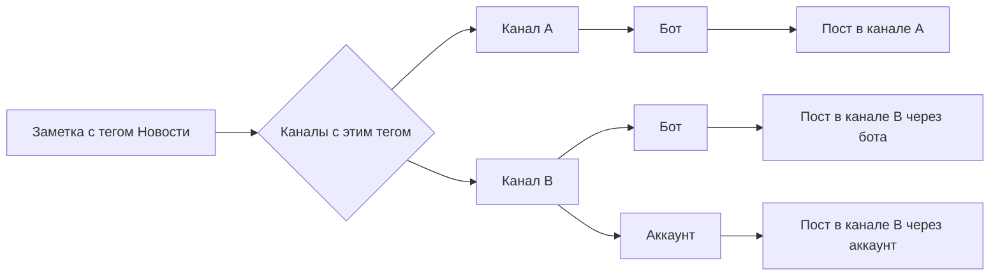

Помимо ботов, сервис умеет публиковать посты от имени обычных Telegram аккаунтов. Это снимает ограничения Bot API и открывает дополнительные возможности.

### Зачем это нужно

**Боты ограничены:**
- Подпись к фото и альбомам — максимум 1024 символа
- Кастомные эмодзи недоступны

**Аккаунты снимают ограничения:**
- Обычный аккаунт: те же лимиты, что у бота
- Premium аккаунт: подпись к фото до 2048 символов, кастомные эмодзи работают

Если вы используете Premium аккаунт для публикации — сервис автоматически определит статус и применит расширенные лимиты.

### Как работает публикация

**Один тег → несколько каналов:**
- Заметка с тегом «Новости» отправится во все каналы с этим тегом
- Канал может быть привязан и к боту, и к аккаунту — пост уйдёт через оба

**Instant Tags:**
- Публикуют сразу после синхронизации
- Удобно для предпросмотра

**Обычные Tags:**
- Публикуют по расписанию из `telegram_publish_at`

### Преимущества Premium

С Premium аккаунтом:
- Подписи к фото и альбомам до 2048 символов вместо 1024
- Кастомные эмодзи в постах
- Те же расширенные возможности, что в обычном Telegram

Если у вас Premium — просто подключите аккаунт. Сервис определит статус автоматически и применит правильные лимиты.

### Ограничения

**Нельзя изменить после публикации:**
- Фотографии и видео — это ограничение Telegram
- Тип поста (добавить медиа в текстовый пост)

**Если нужно изменить медиа:**
- Откройте пост в админке → «Сбросить»
- Пост удалится из канала
- Отредактируйте заметку и синхронизируйте
- Пост опубликуется заново по расписанию

### Бот или аккаунт?

| | Бот | Аккаунт | Premium аккаунт |
|---|---|---|---|
| Подпись к фото | 1024 | 1024 | 2048 |
| Кастомные эмодзи | ❌ | ❌ | ✅ |
| Настройка | Простая | Требует авторизации | Требует авторизации |

**Рекомендация:**
- Для большинства задач хватает бота
- Нужны длинные подписи или кастомные эмодзи? Подключите Premium аккаунт
